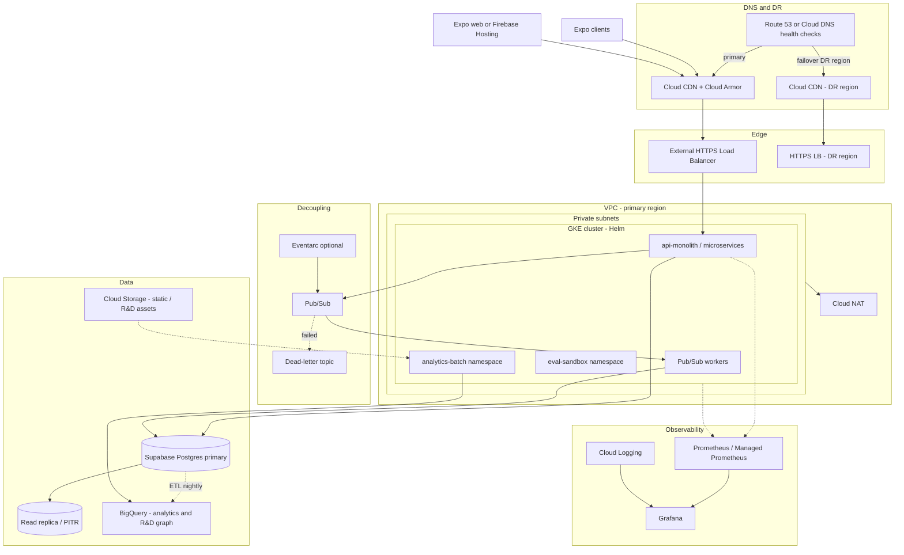
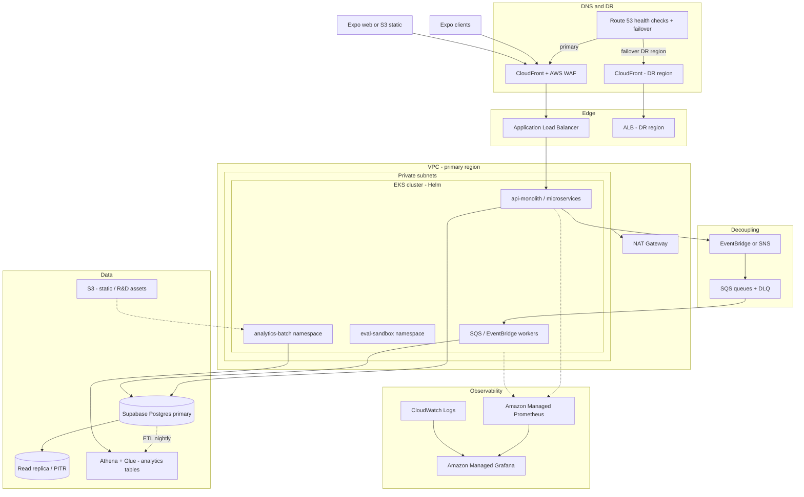
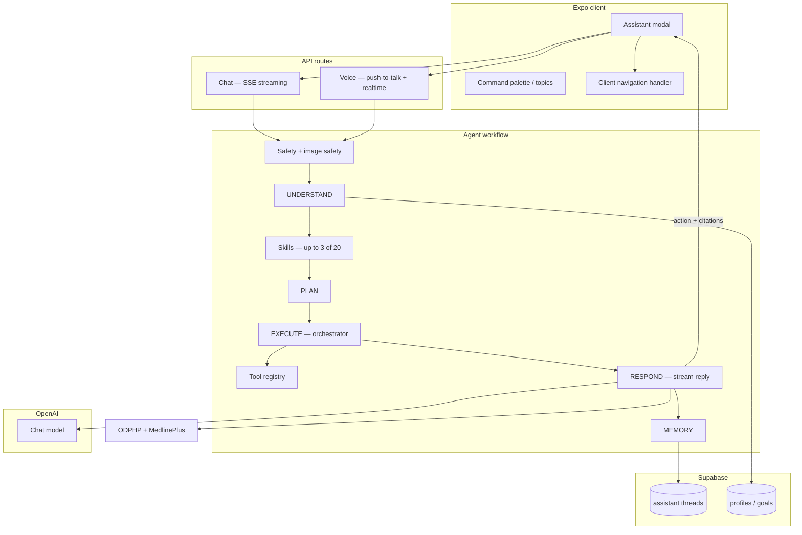
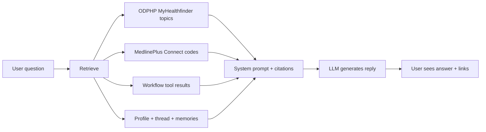

# Appendix — Reference architecture & RAG

Optional reading after the main lab exercises. Diagrams describe **where the product is headed** (Phase 2–3 on a hyperscaler), not what you run in Replit today.

**Today (MVP):** Expo clients → Node API on managed PaaS → Supabase → OpenAI + Google Vision.  
**Future:** Same app logic on **GKE** (Google Cloud) or **EKS** (AWS), with async workers, CDN/WAF, analytics warehouse, and **eval automation** in CI + cluster sandbox.

Pick **one** cloud for production — mixing GCP and AWS control planes adds operational cost. Supabase, OpenAI, and Google Vision stay external SaaS on either path.

---

## A. Future target — Google Cloud (GKE)

**Principle:** evolve incrementally. Near-term wins stay on managed PaaS (logging, backups, async decoupling) before migrating the API to Kubernetes + Helm. **GKE** is the primary documented path below.

### A.1 Target diagram (Phase 2–3)

### A.2 Phased rollout (GCP)

| Phase | Focus | Path |
|-------|-------|------|
| **0 (now)** | Heroku API, Netlify web, Supabase | No change required to ship |
| **1** | DR docs, PITR, structured logs, SLO dashboards | Log drain → Cloud Logging; Grafana Cloud optional |
| **2** | Decouple heavy work | Pub/Sub → GKE workers (timeline rollups, plugin sync, alerts) |
| **3** | API portability | GKE monolith Helm chart behind HTTPS LB + Ingress |
| **4** | Edge hardening | Cloud CDN + Cloud Armor (rate limits on AI endpoints) |
| **5** | Multi-region DR | Second GCP region GKE + DNS failover |
| **R&D** | Property graph analytics | GKE + GCS + BigQuery (separate project or namespace) |

---

## B. Future target — AWS (EKS)

Same phased goals as §A — **Heroku → EKS → async workers → edge hardening → multi-region DR** — using AWS-native edge, networking, and observability. Helm charts and container images are **portable** between GKE and EKS; Ingress, IAM, and managed service bindings change.

### B.1 Target diagram (Phase 2–3)

### B.2 Phased rollout (AWS)

| Phase | Focus | Path |
|-------|-------|------|
| **0 (now)** | Heroku API, Netlify web, Supabase | No change required to ship |
| **1** | DR docs, PITR, structured logs | CloudWatch Logs; Grafana Cloud optional |
| **2** | Decouple heavy work | EventBridge / SNS → SQS → EKS workers |
| **3** | API portability | EKS behind ALB + AWS Load Balancer Controller |
| **4** | Edge hardening | CloudFront + AWS WAF |
| **5** | Multi-region DR | Second AWS region EKS + Route 53 failover |
| **R&D** | Analytics property graph | EKS + S3 + Athena/Glue |

---

## C. GCP (GKE) vs AWS (EKS) — for this product

Helm charts, Supabase, OpenAI, agent workflow, and eval gates are **portable** either way. Below is what matters for ScanAndFindIt specifically.

| | **GCP / GKE** | **AWS / EKS** |
|---|---------------|---------------|
| **Edge** | Cloud CDN + Cloud Armor | CloudFront + AWS WAF |
| **Async work** | Pub/Sub + dead-letter topics | EventBridge → SQS + DLQ |
| **Analytics warehouse** | **BigQuery** (documented R&D path) | **Athena + Glue** (or Redshift) |
| **Object storage** | GCS | S3 |
| **Vision / OCR today** | **Google Vision** shipped — labels, OCR, safe-search on scans | Rekognition + Textract possible — deliberate migration, not a toggle |
| **Web static** | Firebase Hosting or GCS + CDN | S3 + CloudFront |

**Stays the same on either path:** Supabase OLTP + Auth, JWT client contract, agent eval suites, wellness API on Postgres (not the warehouse).

**Practical takeaway:** Choose **GCP** if you want the documented BigQuery R&D path and may keep Google Vision with lower VPC friction. Choose **AWS** if edge/IAM/data-lake skills are already there — budget engineering to migrate Vision or run it cross-cloud.

### C.1 Service mapping (quick reference)

| Concern | Google Cloud | AWS |
|---------|--------------|-----|
| Kubernetes | GKE | EKS |
| Ingress / LB | GCE Ingress / Gateway API | ALB + LB Controller |
| CDN + WAF | Cloud CDN + Cloud Armor | CloudFront + AWS WAF |
| Pod IAM | Workload Identity | IRSA |
| Scheduled jobs | Cloud Scheduler | EventBridge Scheduler |
| DNS + failover | Cloud DNS | Route 53 |

### C.2 FAQ — Vision and analytics

**Could we use AWS Rekognition / Textract instead of Google Vision?**

Yes, in principle — it is a **product migration**, not a config change. Vision today powers scan routing (food, plastic, meds, pets), label OCR, and safe-search moderation. Switching requires a new adapter, re-tuning category inference, and re-running scan contract and safety evals.

| Pattern | When |
|---------|------|
| Keep Google Vision on AWS | Fastest path to EKS; accept cross-cloud API calls |
| Migrate to Rekognition + Textract | Long-term AWS consolidation |
| Stay on GCP + Vision | Lowest friction for current scan code |

**Why BigQuery? Is there an AWS alternative?**

BigQuery is the **analytics warehouse**, not the app database. It supports nightly ETL from Postgres, de-identified research exports, and R&D property-graph batch jobs. **Athena + Glue on S3** is the intentional AWS mirror — same batch-worker pattern on EKS, different SQL and pipeline tooling.

---

## D. In-app AI assistant (context for RAG)

Chat, voice, and in-thread images share one **server-side agent workflow** and up to **three skills per turn**. The client only executes `action` payloads (navigation, scan targets).

| Layer | Role |
|-------|------|
| **Safety** | Blocks jailbreaks and unsafe images before the LLM runs |
| **Understand** | Parses intent, locale, multimodal context |
| **Skills** | Injects up to 3 skill bodies (disclaimers, routing priority) |
| **Tools** | Nutrition lookup, SDOH, Healthy Map, internet search, scans, etc. |
| **Respond** | LLM reply + patient-education citations |

---

## E. Retrieval & citations (RAG) — how data reaches the model

The assistant uses **retrieval-augmented generation** in the sense that replies are grounded on **fetched data injected into the prompt** — not on the model’s memory alone. This is **not** a private document vector database in production today.

| Retrieval source | What it pulls | When |
|------------------|---------------|------|
| **ODPHP MyHealthfinder** | Public health-topic summaries (live API) | General wellness questions |
| **MedlinePlus Connect** | Patient education by ICD-10 (conditions) or NDC/name (medications) | Health questions; also after in-thread drug scans |
| **Workflow tools** | Internet search, scan results, SDOH, maps, market data | Agent EXECUTE phase — results passed into RESPOND context |
| **Profile + thread** | Goals, locale, conversation history | Every turn |
| **Long-term memories** | Stored user notes/preferences | **Keyword overlap** scoring today (not embeddings) |

Citations are merged, de-duplicated, and shown in the UI. Production evals check that replies align with retrieved sources and do not invent facts.

### E.1 Possible improvements (roadmap)

| Gap today | Improvement | Why it helps |
|-----------|-------------|--------------|
| Skill selection is keyword/trigger-based | Semantic / embedding retrieval for skills and memories | Catches paraphrases across locales without exploding regex lists |
| Memories use lexical overlap | Vector search over stored memories (e.g. pgvector) | Better recall of allergies and preferences across threads |
| ODPHP/Medline are live API lookups | Semantic cache of frequent education queries | Lower latency and cost at chat scale |
| Property graph is R&D-only (warehouse batch) | Embedding normalization in analytics namespace | Feeds timeline semantics later — productized only when ready |
| No unified retrieval index | Hybrid search (keyword + vector) over skills, citations, events | One retrieval layer for grounded coaching |

Eval strategy already separates **routing** (deterministic) from **response quality** (citations, grounding, optional semantic judge). Semantic retrieval would add a third offline eval layer for paraphrase recall.

---

## F. Eval sandbox on Kubernetes (why it appears in both diagrams)

The **eval-sandbox** namespace runs automated agent and population checks in CI — warm pools for regression, **not** user traffic. Same eval ideas you practiced in this lab (routing contracts, DGA plausibility bands, grounding guards) scale to hundreds of cases before deploy in a full product stack. The lab stub teaches the pattern; an example production monorepo runs the full suite.

---

## G. CI automation — GitHub Actions (and Terraform note)

Evals are wired into **GitHub Actions** so the same checks run locally and in CI.

### G.1 This lab repo

| Workflow | Trigger | What runs |
|----------|---------|-----------|
| `.github/workflows/evals.yml` | Push / PR to `main` | `npm run population-eval` + `npm run agent-eval` |

Same commands you run in Replit — no API keys.

### G.2 Production backend (conceptual — not in this repo)

| Workflow | Role |
|----------|------|
| Math / population evals | Nutrition cohort + persona checks on goal-calculator changes |
| Agent evals | 166+ routing and response-quality cases on agent/skills changes |
| Nightly agent evals | Full suites; optional **semantic judge** (generator ≠ evaluator) |
| Live staging evals | Weekly real API + OpenAI — catches drift mocks miss |
| Production / release readiness | Full test + eval gate before deploy |

Eval result artifacts upload to GitHub for review — pass rate is **not** a live production metric.

### G.3 Terraform (future)

**Today:** API on Heroku, web on Netlify, Supabase SaaS — **no Terraform in this lab**.

**Phase 2–3 (planned):** Terraform provisions **GKE or EKS** (VPC, node pools, IAM), **eval-sandbox namespace**, event buses (Pub/Sub or SQS), CDN/WAF, and observability. Helm deploys the API; eval jobs run as CI-triggered workloads — **not** user traffic.

| Layer | Purpose |
|-------|---------|
| **Terraform** | Clusters, networking, managed Prometheus/Grafana |
| **Helm** | API, workers, eval-sandbox |
| **GitHub Actions** | Build → test → eval → deploy |

You do **not** need cloud accounts for this lab; this documents **where automation goes** when the platform scales off PaaS.

---

## H. Managed services — today vs future (evals & platform)

### H.1 MVP today

| Service | Role |
|---------|------|
| **Heroku** | Node API |
| **Netlify** | Expo web static |
| **Supabase** | Postgres, Auth, RLS |
| **OpenAI** | Assistant **generator** + optional **evaluator** judge |
| **Google Vision** | Scan labels, OCR, safe-search |
| **GitHub Actions** | CI evals (this repo + production monorepo) |

Evals run on **GitHub-hosted runners** — not on user request paths.

### H.2 Future platform options

See §A–C above. Pick **one** hyperscaler (GKE + BigQuery **or** EKS + Athena/Glue).

| Option | When it fits |
|--------|----------------|
| **Stay on PaaS longer** | Small team — add logging, backups, async queues first |
| **GKE + BigQuery** | Documented path; keep Google Vision; analytics R&D |
| **EKS + Athena/Glue** | Team already on AWS; budget Vision migration or cross-cloud calls |

### H.3 Future evals roadmap

| Direction | Notes |
|-----------|-------|
| **267-case offline gate** | Shipped in example production stack — deterministic contracts block deploy |
| **Live staging chat evals** | Shipped — weekly; real SSE/auth/threads |
| **Semantic judge** | Opt-in — separate model scores rubric; not default PR CI |
| **Eval sandbox on GKE/EKS** | Planned — warm pool namespace for full suite |
| **Semantic retrieval eval layer** | Roadmap — paraphrase recall across locales (pgvector / hybrid search) |
| **Third-party eval platforms** | Optional — dashboards/rubrics; **assertions stay in-repo** for deploy gate |

**Principle:** Managed services reduce ops toil; **eval contracts stay version-controlled** so releases cannot skip the same checks you ran in this lab.

---

*This appendix uses only public architecture concepts and educational stubs. It does not grant production access, cloud accounts, or legal advice.*
