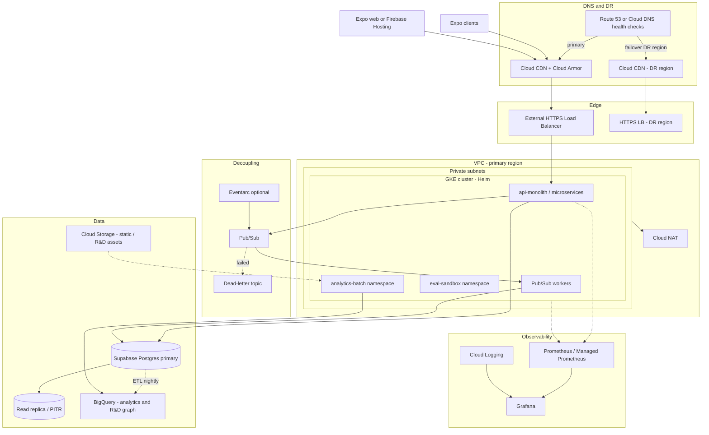
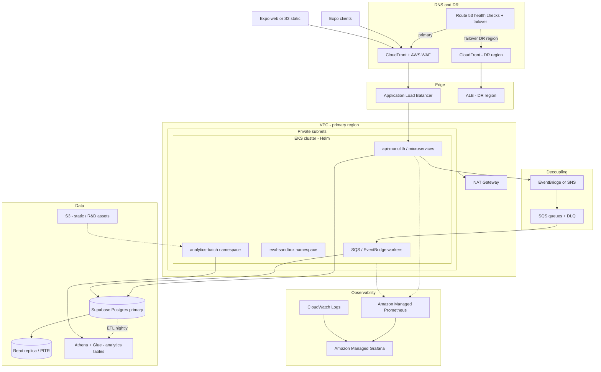
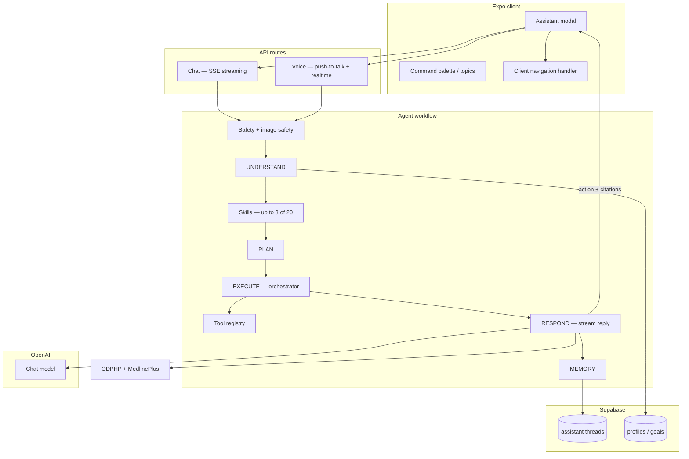
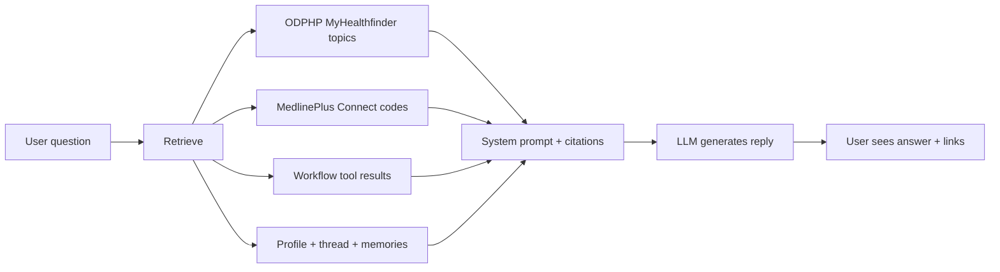
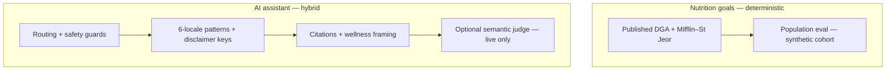
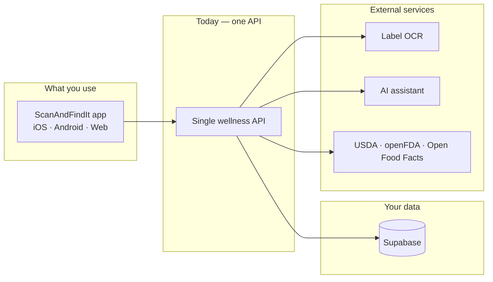
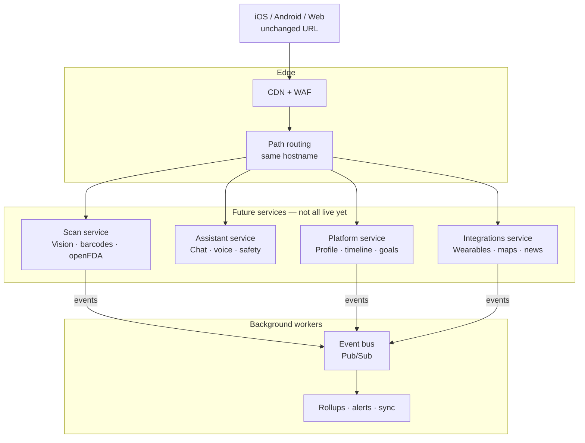
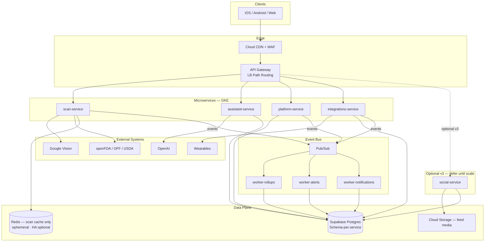
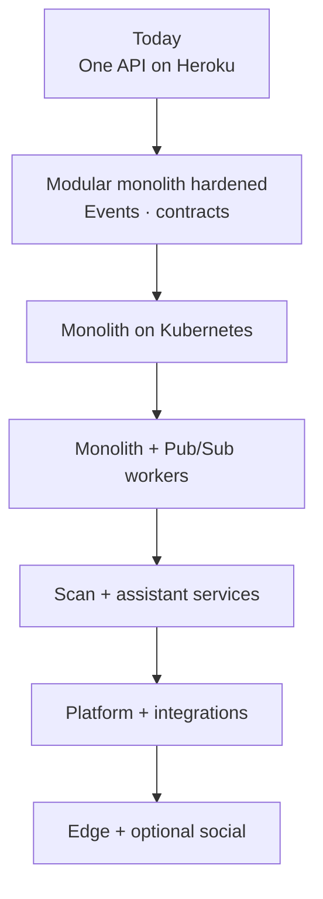
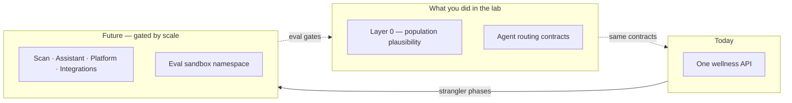

# Appendix — Reference architecture & RAG

Optional reading after the main lab exercises. Diagrams describe **where the product is headed** (Phase 2–3 on a hyperscaler), not what you run in Replit today. **§G** covers **CI and Terraform**; **§H** covers **managed services**; **§I** covers **algorithmic bias**; **§J** covers **platform evolution and microservices** — including **ML vs infrastructure drift** ([§J.17](#j17-drift-detection)).

**Today (MVP):** Expo clients → Node API on managed PaaS → Supabase → OpenAI + Google Vision.  
**Future:** Same app logic on **GKE** (Google Cloud) or **EKS** (AWS), with async workers, CDN/WAF, analytics warehouse, and **eval automation** in CI + cluster sandbox.

Pick **one** cloud for production — mixing GCP and AWS control planes adds operational cost. Supabase, OpenAI, and Google Vision stay external SaaS on either path.

---

## A. Future target — Google Cloud (GKE)

**Principle:** evolve incrementally. Near-term wins stay on managed PaaS (logging, backups, async decoupling) before migrating the API to Kubernetes + Helm. **GKE** is the primary documented path below.

### A.1 Target diagram (Phase 2–3)

### A.2 Phased rollout (GCP)

| Phase | Focus | Path |
|-------|-------|------|
| **0 (now)** | Heroku API, Netlify web, Supabase | No change required to ship |
| **1** | DR docs, PITR, structured logs, SLO dashboards | Log drain → Cloud Logging; Grafana Cloud optional |
| **2** | Decouple heavy work | Pub/Sub → GKE workers (timeline rollups, plugin sync, alerts) |
| **3** | API portability | GKE monolith Helm chart behind HTTPS LB + Ingress |
| **4** | Edge hardening | Cloud CDN + Cloud Armor (rate limits on AI endpoints) |
| **5** | Multi-region DR | Second GCP region GKE + DNS failover |
| **R&D** | Property graph analytics | GKE + GCS + BigQuery (separate project or namespace) |

---

## B. Future target — AWS (EKS)

Same phased goals as §A — **Heroku → EKS → async workers → edge hardening → multi-region DR** — using AWS-native edge, networking, and observability. Helm charts and container images are **portable** between GKE and EKS; Ingress, IAM, and managed service bindings change.

### B.1 Target diagram (Phase 2–3)

### B.2 Phased rollout (AWS)

| Phase | Focus | Path |
|-------|-------|------|
| **0 (now)** | Heroku API, Netlify web, Supabase | No change required to ship |
| **1** | DR docs, PITR, structured logs | CloudWatch Logs; Grafana Cloud optional |
| **2** | Decouple heavy work | EventBridge / SNS → SQS → EKS workers |
| **3** | API portability | EKS behind ALB + AWS Load Balancer Controller |
| **4** | Edge hardening | CloudFront + AWS WAF |
| **5** | Multi-region DR | Second AWS region EKS + Route 53 failover |
| **R&D** | Analytics property graph | EKS + S3 + Athena/Glue |

---

## C. GCP (GKE) vs AWS (EKS) — for this product

Helm charts, Supabase, OpenAI, agent workflow, and eval gates are **portable** either way. Below is what matters for ScanAndFindIt specifically.

| | **GCP / GKE** | **AWS / EKS** |
|---|---------------|---------------|
| **Edge** | Cloud CDN + Cloud Armor | CloudFront + AWS WAF |
| **Async work** | Pub/Sub + dead-letter topics | EventBridge → SQS + DLQ |
| **Analytics warehouse** | **BigQuery** (documented R&D path) | **Athena + Glue** (or Redshift) |
| **Object storage** | GCS | S3 |
| **Vision / OCR today** | **Google Vision** shipped — labels, OCR, safe-search on scans | Rekognition + Textract possible — deliberate migration, not a toggle |
| **Web static** | Firebase Hosting or GCS + CDN | S3 + CloudFront |

**Stays the same on either path:** Supabase OLTP + Auth, JWT client contract, agent eval suites, wellness API on Postgres (not the warehouse).

**Practical takeaway:** Choose **GCP** if you want the documented BigQuery R&D path and may keep Google Vision with lower VPC friction. Choose **AWS** if edge/IAM/data-lake skills are already there — budget engineering to migrate Vision or run it cross-cloud.

### C.1 Service mapping (quick reference)

| Concern | Google Cloud | AWS |
|---------|--------------|-----|
| Kubernetes | GKE | EKS |
| Ingress / LB | GCE Ingress / Gateway API | ALB + LB Controller |
| CDN + WAF | Cloud CDN + Cloud Armor | CloudFront + AWS WAF |
| Pod IAM | Workload Identity | IRSA |
| Scheduled jobs | Cloud Scheduler | EventBridge Scheduler |
| DNS + failover | Cloud DNS | Route 53 |

### C.2 FAQ — Vision and analytics

**Could we use AWS Rekognition / Textract instead of Google Vision?**

Yes, in principle — it is a **product migration**, not a config change. Vision today powers scan routing (food, plastic, meds, pets), label OCR, and safe-search moderation. Switching requires a new adapter, re-tuning category inference, and re-running scan contract and safety evals.

| Pattern | When |
|---------|------|
| Keep Google Vision on AWS | Fastest path to EKS; accept cross-cloud API calls |
| Migrate to Rekognition + Textract | Long-term AWS consolidation |
| Stay on GCP + Vision | Lowest friction for current scan code |

**Why BigQuery? Is there an AWS alternative?**

BigQuery is the **analytics warehouse**, not the app database. It supports nightly ETL from Postgres, de-identified research exports, and R&D property-graph batch jobs. **Athena + Glue on S3** is the intentional AWS mirror — same batch-worker pattern on EKS, different SQL and pipeline tooling.

---

## D. In-app AI assistant (context for RAG)

Chat, voice, and in-thread images share one **server-side agent workflow** and up to **three skills per turn**. The client only executes `action` payloads (navigation, scan targets).

| Layer | Role |
|-------|------|
| **Safety** | Blocks jailbreaks and unsafe images before the LLM runs |
| **Understand** | Parses intent, locale, multimodal context |
| **Skills** | Injects up to 3 skill bodies (disclaimers, routing priority) |
| **Tools** | Nutrition lookup, SDOH, Healthy Map, internet search, scans, etc. |
| **Respond** | LLM reply + patient-education citations |

---

## E. Retrieval & citations (RAG) — how data reaches the model

The assistant uses **retrieval-augmented generation** in the sense that replies are grounded on **fetched data injected into the prompt** — not on the model’s memory alone. This is **not** a private document vector database in production today.

| Retrieval source | What it pulls | When |
|------------------|---------------|------|
| **ODPHP MyHealthfinder** | Public health-topic summaries (live API) | General wellness questions |
| **MedlinePlus Connect** | Patient education by ICD-10 (conditions) or NDC/name (medications) | Health questions; also after in-thread drug scans |
| **Workflow tools** | Internet search, scan results, SDOH, maps, market data | Agent EXECUTE phase — results passed into RESPOND context |
| **Profile + thread** | Goals, locale, conversation history | Every turn |
| **Long-term memories** | Stored user notes/preferences | **Keyword overlap** scoring today (not embeddings) |

Citations are merged, de-duplicated, and shown in the UI. Production evals check that replies align with retrieved sources and do not invent facts.

### E.1 Possible improvements (roadmap)

| Gap today | Improvement | Why it helps |
|-----------|-------------|--------------|
| Skill selection is keyword/trigger-based | Semantic / embedding retrieval for skills and memories | Catches paraphrases across locales without exploding regex lists |
| Memories use lexical overlap | Vector search over stored memories (e.g. pgvector) | Better recall of allergies and preferences across threads |
| ODPHP/Medline are live API lookups | Semantic cache of frequent education queries | Lower latency and cost at chat scale |
| Property graph is R&D-only (warehouse batch) | Embedding normalization in analytics namespace | Feeds timeline semantics later — productized only when ready |
| No unified retrieval index | Hybrid search (keyword + vector) over skills, citations, events | One retrieval layer for grounded coaching |

Eval strategy already separates **routing** (deterministic) from **response quality** (citations, grounding, optional semantic judge). Semantic retrieval would add a third offline eval layer for paraphrase recall.

---

## F. Eval sandbox on Kubernetes (why it appears in both diagrams)

The **eval-sandbox** namespace runs automated agent and population checks in CI — warm pools for regression, **not** user traffic. Same eval ideas you practiced in this lab (routing contracts, DGA plausibility bands, grounding guards) scale to hundreds of cases before deploy in a full product stack. The lab stub teaches the pattern; an example production monorepo runs the full suite.

---

## G. CI automation — GitHub Actions (and Terraform)

Evals are wired into **GitHub Actions** so the same checks run locally and in CI.

### G.1 This lab repo

| Workflow | Trigger | What runs |
|----------|---------|-----------|
| `.github/workflows/evals.yml` | Push / PR to `main` | `npm run population-eval` + `npm run agent-eval` |

Same commands you run in Replit — no API keys.

### G.2 Production backend (conceptual — not in this repo)

| Workflow | Role |
|----------|------|
| Math / population evals | Nutrition cohort + persona checks on goal-calculator changes |
| Agent evals | 166+ routing and response-quality cases on agent/skills changes |
| Nightly agent evals | Full suites; optional **semantic judge** (generator ≠ evaluator) |
| Live staging evals | Weekly real API + OpenAI — catches drift mocks miss |
| Production / release readiness | Full test + eval gate before deploy |

Eval result artifacts upload to GitHub for review — pass rate is **not** a live production metric.

### G.3 Terraform — Infrastructure as Code (future)

**Today:** API on Heroku, web on Netlify, Supabase SaaS — **no Terraform in this lab**. PaaS config vars are enough at MVP scale.

**Phase 2–3 (planned):** [Terraform](https://developer.hashicorp.com/terraform/docs) provisions the **cloud control plane** — VPC, GKE/EKS, IAM, Pub/Sub (or SQS), CDN/WAF, observability — as versioned `.tf` files in git. **Helm** deploys app workloads; **GitHub Actions** runs build → eval → `terraform plan` → (approved) `apply`.

> **Official reference:** [Terraform documentation](https://developer.hashicorp.com/terraform/docs). Deeper reads: [configuration language](https://developer.hashicorp.com/terraform/language), [state](https://developer.hashicorp.com/terraform/language/state), [modules](https://developer.hashicorp.com/terraform/language/modules), [CLI `plan` / `apply`](https://developer.hashicorp.com/terraform/cli/commands/plan).

| Concept | What it means (lab cheat sheet) |
|---------|----------------------------------|
| **Infrastructure as Code** | Infra in files, reviewed in PRs — not manual console clicks |
| **Declarative config** | Describe *desired state*; Terraform reconciles the cloud to match |
| **Plan vs apply** | `plan` = dry-run diff; `apply` = execute after review |
| **State** | Tracks what Terraform created (remote backend in GCS/S3 — **not** in git) |
| **Variables & outputs** | Per-environment inputs; outputs feed deploy jobs or other modules |
| **Modules** | Reusable `.tf` packages — same cluster pattern for staging and prod |
| **Idempotency** | Re-run `apply` safely — no change → “0 to add, 0 to change, 0 to destroy” |
| **Environments** | Separate state per env (`dev` / `staging` / `prod`) — never share prod state |

**What Terraform provisions (not Helm):** VPC and subnets, GKE/EKS cluster, Workload Identity / IRSA, Pub/Sub + dead-letter topics, CDN/WAF, managed Prometheus/Grafana, and the **eval-sandbox** namespace for warm CI golden queries — isolated from user traffic. See [§J](./APPENDIX.md#j-platform-evolution--microservices--lab-connection) for how this fits the phased migration.

| Layer | Owns | Tool |
|-------|------|------|
| **Platform** | Clusters, networking, IAM, event bus, edge, observability | Terraform |
| **Workloads** | API, workers, eval-sandbox pods | Helm |
| **Pipeline** | Build → test → eval → plan/apply → deploy | GitHub Actions |

**Honest status:** Terraform is **planned**, not shipped. Eval gates (population + agent routing) stay in GitHub Actions — Terraform changes *where* workloads run, not *what* we verify.

You do **not** need cloud accounts for this lab; this documents **where automation goes** when the platform scales off PaaS.

---

## H. Managed services — today vs future (evals & platform)

### H.1 MVP today

| Service | Role |
|---------|------|
| **Heroku** | Node API |
| **Netlify** | Expo web static |
| **Supabase** | Postgres, Auth, RLS |
| **OpenAI** | Assistant **generator** + optional **evaluator** judge |
| **Google Vision** | Scan labels, OCR, safe-search |
| **GitHub Actions** | CI evals (this repo + production monorepo) |

Evals run on **GitHub-hosted runners** — not on user request paths.

### H.2 Future platform options

See [§A–C](./APPENDIX.md#a-future-target--google-cloud-gke) (architecture) and [§G.3](./APPENDIX.md#g3-terraform--infrastructure-as-code-future) (IaC). Pick **one** hyperscaler (GKE + BigQuery **or** EKS + Athena/Glue).

| Option | When it fits |
|--------|----------------|
| **Stay on PaaS longer** | Small team — add logging, backups, async queues first |
| **GKE + BigQuery** | Documented path; keep Google Vision; analytics R&D |
| **EKS + Athena/Glue** | Team already on AWS; budget Vision migration or cross-cloud calls |

### H.3 Future evals roadmap

| Direction | Notes |
|-----------|-------|
| **267-case offline gate** | Shipped in example production stack — deterministic contracts block deploy |
| **Live staging chat evals** | Shipped — weekly; real SSE/auth/threads |
| **Semantic judge** | Opt-in — separate model scores rubric; not default PR CI |
| **Eval sandbox on GKE/EKS** | Planned — warm pool namespace; Terraform + Helm per §G.3 |
| **Semantic retrieval eval layer** | Roadmap — paraphrase recall across locales (pgvector / hybrid search) |
| **Third-party eval platforms** | Optional — dashboards/rubrics; **assertions stay in-repo** for deploy gate |

**Principle:** Managed services reduce ops toil; **eval contracts stay version-controlled** so releases cannot skip the same checks you ran in this lab.

---

## I. Algorithmic bias — mitigation & lab connection

Optional depth after [Integrity & wellness boundaries](./README.md#integrity--wellness-boundaries) in the main README.

**One-line framing:** Bias mitigation here is mostly **transparent rules + representative testing + integrity guardrails**, not “we trained on diverse data so the model is fair.” Synthetic cohort data is a **test harness** for population plausibility, not training data that debiases an ML model.

### I.1 Two surfaces where bias can appear

| Surface | Mechanism | Primary bias risk |
|---------|-----------|-------------------|
| **Nutrition goal math** | Deterministic formulas (BMI → BMR → activity → DGA bands) | Systematic over/under-estimation for body types, life stages, or activity levels the formulas handle poorly |
| **In-app AI assistant** | LLM replies + routing/tools/skills across 6 locales | Wrong tool for a locale or phrasing; authoritative tone; clinical overreach; training-data skew in the foundation model |

### I.2 Where bias can enter (even with good intentions)

| Source | Example | Why it matters at scale |
|--------|---------|---------------------------|
| **Formula defaults** | Default activity = sedentary when unknown | Conservative for intake, but may feel “punishing” vs over-estimating |
| **Sex/gender buckets in BMR** | Male/female/other floors and offsets | Simplified physiology; must not encode stigma or exclude nonbinary users from usable targets |
| **High BMI handling** | Adjusted weight for BMR only | Corrects over-prediction; easy to mis-explain to users as judgment |
| **English-first routing patterns** | Typo or dialect not in regex | Silent misroute — feels broken or discriminatory for non-English users |
| **LLM training data** | Tone, cultural food norms, gendered health advice | Routing can pass while **wording** still harms or misleads |
| **Device & literacy barriers** | Vision scan fails; voice not available | Benefits skew toward digitally fluent, sighted, high-bandwidth users |
| **Research narrative** | Cohort simulation cited as “impact” | Overstates benefit for groups underrepresented in synthetic data |

Report disparities with **structural context** (design, infrastructure, policy) — not as inherent group limitations.

### I.3 Mitigations in place today

#### Nutrition math

| Mitigation | What it does |
|------------|--------------|
| **Published standards** | [DGA 2020–2025](https://www.dietaryguidelines.gov/) bands, Mifflin–St Jeor BMR, documented activity multipliers — not opaque ML on user behavior |
| **Special populations** | Pregnancy/lactation add-ons, older-adult life stage (60+), BMI ≥ 30 adjusted weight for BMR, sex-specific calorie floors |
| **Hand-curated personas** | Edge cases in population eval (high BMI, pregnancy, adolescents) — see `population-eval/synthetic-personas.json` |
| **Population eval** | NHANES-*like* synthetic adults; **≥ 85%** within DGA band + safety floors/ceiling — catches **cohort-level drift** |
| **No race-based targeting** | Product logic does not segment or treat users by race/ethnicity |

#### AI assistant & product integrity

| Mitigation | What it does |
|------------|--------------|
| **Offline routing evals** | Example production stacks use hundreds of cases; this lab stub teaches the same **contract** idea — binary pass per scenario |
| **Locale coverage** | Routing regression and disclaimer keys for **EN, ES, AR, ZH, HI, SW** |
| **Negative guards** | e.g. food-safety questions stay in chat — do not open scanner ([Top 10 #2](./README.md#part-2--trust-the-agent)) |
| **Hallucination / grounding cases** | No diagnosis, no FDA approval claims, no invented profile or intake data |
| **Mandatory citations** | ODPHP / MedlinePlus for educational replies — reduces invented “facts” |
| **Live + semantic judge (opt-in)** | Second model scores high-risk **wording** (overdose + driving, travel compound) when mocks are not enough |
| **Inclusive gender options** | Profile supports diverse gender identity; math uses documented buckets with explicit floors |
| **ADA-oriented UX** | WCAG labels, focus, large text (ongoing product work) |

### I.4 Role of data — test harness, not debiasing training

Participants often ask: *“Do we use data to reduce bias?”* Be precise:

| Use of data | Role | In this lab? |
|-------------|------|--------------|
| **NHANES-like synthetic cohort** | Sample demographics from published CDC **summary statistics**; run calorie math at scale | **Yes** — `population-eval/` |
| **Fixed random seed** | Reproducible cohort between runs | **Yes** — change `SEED` in [Part 1 exercise](./README.md#part-1--trust-the-math) |
| **Hand-curated personas** | Named edge cases the sampler might under-represent | **Yes** — `short_heavy_female_moderate` task |
| **User production data for ML training** | **Not used** for routing or calorie formulas in this product model | **No** |
| **Stratified equity analysis** | Compare adherence, scan success, burden by age/gender/locale | **Research / future** — optional survey layer |

**Synthetic cohort caveat:** Marginal sampling from published stats does **not** preserve full covariance (region, socioeconomic links, rare subgroups). Fine for **workshop plausibility**; not enough for research claims about real populations.

### I.5 Eval & guardrail map (quick reference)

| Bias-adjacent failure | Product stance | Eval / guardrail |
|-----------------------|----------------|------------------|
| Calorie targets drift low/high for many profiles | Wellness estimates from DGA pipeline | Population eval ≥ 85% in band; persona JSON |
| Wrong scanner by locale or typo | Same server `action` contract on all clients | Routing cases per locale; typo cases (e.g. “scam my food”) |
| Assistant implies diagnosis or FDA approval | General wellness only | Hallucination guards; disclaimers |
| Invented user data | Use only profile fields on file | Factual-grounding cases |
| Harmful safety wording | Urgent help; no minimizing overdose | Safety + response-quality cases |
| Non-English disclaimer gaps | Same legal meaning in 6 locales | Locale compliance tests |
| SDOH routed to wrong tool | Benefits programs ≠ camera “snap” | SDOH routing cases + benefits-program guards |

### I.6 What passing does **not** prove

| Claim | Verdict |
|-------|---------|
| “Fair outcomes for all demographic groups” | **Not proven** by Layer 0 alone |
| “Clinically correct for any individual” | **Not proven** — plausibility only |
| “LLM replies are unbiased in tone and culture” | **Not fully proven** — offline contracts + optional judge reduce risk |
| “Synthetic cohort predicts real-world NHANES” | **Not claimed** — summary-stat sampling ≠ full survey covariance |
| “No digital divide” | **Not measured** in lab — device, bandwidth, literacy still matter |

**Integrity hook:** If population Layer 0 fails, do **not** cite simulated Layer 1–3 “AI impact” cohort charts in decks or demos ([Research layers](./README.md#research-layers-context-only)).

### I.7 Gaps & honest scope

| Gap | Direction |
|-----|-----------|
| LLM tone bias by gender or culture | Stratified audits; expand live semantic judge coverage |
| Locale regex holes | Add regression eval per new variant when bugs are found |
| Older adults / low vision | Simplified flows, voice (planned); stratify scan success by age in research |
| Equity of API cost / device burden | Analyze by region and device tier in research design |
| Formal legal sign-off on algorithmic bias | Product compliance milestone |

### I.8 Lab exercises that touch bias

| Lab moment | Bias lesson |
|------------|-------------|
| [Part 1 — population eval](./README.md#part-1--trust-the-math) | Representative **testing** catches systematic math drift; BMI-adjusted weight persona |
| [Part 2 — agent eval](./README.md#part-2--trust-the-agent) | “Helpful” wrong action (scanner vs chat; SDOH vs snap) is an integrity/bias failure |
| [Top 10 impact table](./README.md#part-2--trust-the-agent) | Each row locks a failure mode that disproportionately breaks trust |
| [Integrity section](./README.md#integrity--wellness-boundaries) | Connect product promise to automated proof |
| [Self-debrief #3](./README.md#self-debrief) | One persona vs hundreds of synthetic profiles |

### I.9 Reflect — facilitator-style prompts

| Prompt | Expected direction |
|--------|-------------------|
| “Is NHANES-like data the same as training a fair ML model?” | **No** — it tests deterministic math across synthetic demographics |
| “What does ≥ 85% in DGA band actually guarantee?” | Plausibility / regression safety — not fairness or clinical validity |
| “Where could the assistant sound helpful but act out of integrity?” | Wrong tool, FDA implication, English-only routing, invented intake |
| “What bias risk remains after all offline cases pass?” | Wording drift, locale gaps, digital divide, over-trusting authoritative tone |
| “If Layer 0 fails, can we still show AI impact slides?” | **No** — Layer 0 blocks citing cohort simulation narratives |

---

## J. Platform evolution & microservices — lab connection

**Ground rules (same as the lab):** ScanAndFindIt is *general wellness education*, not clinical advice. The product is **not FDA approved**. Evals verify alignment in code — they are not legal proof of compliance.

**Honest status:** **Kubernetes and microservices are not in production today.** This section describes a **future target** when scale and metrics justify phased change — not what you run in Replit.

**Related appendix sections:** [§A–C](./APPENDIX.md#a-future-target--google-cloud-gke) (future GKE/AWS architecture) · [§G.3](./APPENDIX.md#g3-terraform--infrastructure-as-code-future) (Terraform IaC) · [§H](./APPENDIX.md#h-managed-services--today-vs-future-evals--platform) (managed services) · [§I.6](./APPENDIX.md#i6-what-passing-does-not-prove) (what evals do not prove) · [§J.17](#j17-drift-detection) (ML vs infrastructure drift)

---

### J.1 Why this matters after the lab

The lab focuses on **evals and integrity** — population plausibility and agent routing contracts. At **large scale**, architecture choices affect whether those contracts stay trustworthy:

- A vision spike on the food scanner should not slow down chat or goal math.
- A bad assistant deploy should not take down barcode lookup.
- Production **267 offline agent cases** and the **Layer 0 population gate** must still pass after every infrastructure change.

This section explains **how the platform evolves in phases** — without a big-bang rewrite — and why that matters for the same integrity story you saw in the lab. See also [Lab vs production](./README.md#lab-vs-production).

---

### J.2 Today — one API, many features

Right now, mobile and web talk to **one Node API** on managed hosting (Heroku). That API handles scanning, nutrition goals, the AI assistant, wearables, and more. User data lives in **Supabase** (Postgres + auth). Scan labels use **Google Vision**; the assistant uses **OpenAI**.

| What you experience | What runs behind it |
| ------------------- | ------------------- |
| Scan a barcode or label | Vision + public food/drug databases |
| See calorie targets | DGA-based goal math (Layer 0 eval checks this) |
| Chat with the wellness assistant | Safety gates → skills → tools → response (agent evals lock routing) |
| Timeline and check-ins | Dated health events in Supabase |

This is the **right shape for MVP** — one deployable API, strong module structure inside, eval gates in CI.

---

### J.3 The plan — evolve in slices (strangler fig)

We follow an industry pattern called the **strangler fig**: new pieces grow around the old system; traffic moves **slice by slice**; obsolete parts are removed only when the replacement is proven.

| Step | Plain-language meaning | ScanAndFindIt example |
| ---- | ---------------------- | --------------------- |
| **1. Understand today** | Map what exists | One API, many internal modules, one database |
| **2. Tighten modules inside the monolith** | Clear boundaries before splitting | Contracts between scanning, goals, assistant |
| **3. Separate database areas** | Logical ownership before physical split | Postgres *schemas* per domain (still one Supabase) |
| **4. Define standalone services** | Container + deploy unit per slice | Scan service, assistant service, etc. |
| **5. Deploy and validate (no user traffic)** | Ship the new service; run synthetic, shadow, and eval traffic only | [FTGO Step 3](https://microservices.io/refactoring/example-of-extracting-a-service.html): *“does not handle production traffic”* until proven |
| **6. Route traffic gradually** | Canary paths to new service; rest stays on monolith | Users keep **the same app URL** |
| **7. Remove old code** | Delete extracted routes from the monolith | Smaller core until fully modernized |

**Methodology:** [FTGO extraction example](https://microservices.io/refactoring/example-of-extracting-a-service.html) (Food to Go). **Critical nuance:** deploy the standalone service first; **do not route live user traffic** until shadow/canary validation passes ([§J.8](#j8-shadow-canary-and-rollback-criteria)).

---

### J.4 Future shape — four core services (+ workers)

When scale and metrics justify it, the **same app** will still call **one public API address**. Behind the load balancer, work splits by **cost and risk profile**:

| Future service | What it owns (user-facing) | Why split it |
| -------------- | -------------------------- | ------------ |
| **Scan** | Food/plastic/drug/pet scans, nutrition lookup | Vision cost and burst traffic |
| **Assistant** | Chat, voice, tool routing, thread history | LLM cost, long-lived connections, safety pipeline |
| **Platform** | Profile, health timeline, goals, check-ins, account | Steady CRUD; single writer for timeline events |
| **Integrations** | Wearables, weather, health news, maps | OAuth tokens, scheduled sync jobs |
| **Social** (optional, later) | Teams, feed, wellness studio posts | Defer until v3 scale needs it |

**Workers** (not user-facing HTTP) handle timeline rollups, recall alerts, and wearable sync — so heavy jobs do not block your scan or chat.

---

### J.5 Target microservices architecture (full diagram)

**Future steady state** — not live today. Same app URL; path routing sends each request to the right service. Pairs with [§A.1](./APPENDIX.md#a1-target-diagram-phase-23) (cluster-level view).

| Layer | What it is | You care because… |
| ----- | ---------- | ----------------- |
| **Clients** | Same app on iOS, Android, web | No new URL |
| **Edge (CDN + WAF)** | Global cache + web application firewall | Protects assistant routes from abuse at scale |
| **API Gateway** | One hostname; routes like `/api/food/*` → scan, `/api/chat/*` → assistant | Invisible to users; one API base URL |
| **Microservices** | **Four core** deploy units (+ social optional v3) | Scan/assistant spikes don’t take down goals or timeline |
| **Event bus (Pub/Sub)** | Durable pub/sub for domain events | Scan completes → timeline updates without blocking your request |
| **Workers** | Background jobs (rollups, alerts, notifications) | Dashboards stay fast |
| **Data plane** | Supabase (schema-per-service); **Redis for scan-result cache only** (ephemeral; loss degrades latency, not correctness); GCS for optional social media | Logical ownership per domain — see [§J.6](#j6-data-architecture--interim-vs-target) |
| **Eval sandbox namespace** | Separate K8s namespace for CI golden queries | Full production gate runs warm; never shares live user traffic — see [§F](./APPENDIX.md#f-eval-sandbox-on-kubernetes-why-it-appears-in-both-diagrams) |

**One-line summary:** *One front door for the app; four core kitchens behind it — social is optional later; an event bus for side effects; same Supabase and same eval gates.*

---

### J.6 Data architecture — interim vs target

Schema-per-service on **one Supabase Postgres** is an **interim** pattern, not the final autonomy target.

| Stage | Pattern | Consistency | When |
| ----- | ------- | ------------- | ---- |
| **Interim (Phase 0–2)** | Shared Postgres; logical schemas; monolith service role | Strong consistency inside the monolith | Now → first K8s lift + async workers |
| **Mid (Phase 3–4)** | Schema-scoped DB credentials; **single writer** for timeline events (platform-service) | **Eventual** consistency across services via Pub/Sub | After first service extractions |
| **Target (Phase 5+)** | Optional read replicas; BigQuery/Athena for analytics | OLTP stays Postgres; analytics decoupled | When scale and team justify it |

**Transactional boundaries (not one ACID transaction after split):**

| Flow | Pattern | Owner |
| ---- | ------- | ----- |
| Profile + onboarding | **Single transaction** | platform-service |
| Scan → timeline | **Eventual** via `scan.completed` → platform consumer | scan publishes; platform writes events |
| Goal recompute | **Eventual** via profile-updated event | platform-service |
| OAuth token refresh | **Integrations-service only** | No cross-service token reads |

**Distributed event patterns (required once async workers and splits are live):**

| Pattern | Purpose |
| ------- | ------- |
| **Transactional outbox** | DB write and event emit succeed or fail together |
| **Idempotency keys** | Prevent duplicate timeline rows on Pub/Sub retries |
| **Dead-letter topic (DLQ)** | Poison messages do not block the bus; replay after fix |
| **At-least-once delivery** | Consumers must be idempotent — assume duplicates |

> **Coupling risk:** Shared Supabase still shares connection limits and migration blast radius. Schema-per-service is **ownership enforcement**, not full isolation, until credentials and write paths are scoped per domain.

---

### J.7 Phased timeline — when, not if-by-date

Migration is **gated by metrics**, not a calendar mandate (e.g. scan latency spikes when chat is busy, or AI cost dominates infra spend).

| Phase | What changes | User-visible impact |
| ----- | ------------ | ------------------- |
| **0 — Foundation** | Stronger module contracts; timeline events; wearable tokens in Postgres | **None** |
| **1 — Container lift** | Same code on Kubernetes (GKE or EKS) with Helm | **None** — DNS/ops only |
| **2 — Async workers** | Event bus (Pub/Sub) + background jobs | **None** — faster dashboards over time |
| **3 — First splits** | Scan + assistant; **shadow/canary** before full routing ([§J.8](#j8-shadow-canary-and-rollback-criteria)) | **None** — same API URL |
| **4 — Platform + integrations** | Remaining domains extracted | **None** |
| **5 — Edge + optional social** | CDN/WAF hardening; social split if needed | **None** |

First service extractions are **earliest ~12–18 months** after foundation gates pass — subject to measurable scale triggers, not a fixed calendar.

---

### J.8 Shadow, canary, and rollback criteria

Each phase follows [FTGO Step 3](https://microservices.io/refactoring/example-of-extracting-a-service.html): **deploy first, route user traffic only after validation**.

| Phase | Shadow / canary approach | Rollback trigger | Rollback action |
| ----- | ------------------------ | ---------------- | --------------- |
| **0 — Foundation** | No traffic shift; CI contract tests | Layer 0 or agent eval failure | Block merge / deploy |
| **1 — Container lift** | Blue/green K8s vs Heroku; latency parity tests | p99 latency > baseline +20%; error rate > 0.5% | DNS back to Heroku |
| **2 — Async workers** | Dual-write events; shadow subscription first | Duplicate rollups; consumer lag > SLO; DLQ spike | Disable consumers; monolith fallback |
| **3 — First splits** | Deploy with **zero user traffic**; canary **1% → 10% → 50% → 100%** | Agent eval failure; shadow diff on golden scans | Ingress **100% to monolith** |
| **4 — Platform + integrations** | Per-service canary; DSAR/OAuth soak | DSAR or sync failures | Route paths back to core-api |
| **5 — Edge + optional social** | CDN/WAF canary; social shadow traffic | Moderation SLA breach; WAF false positives | Revert rules; social to platform-service |

**Every phase gate (before increasing traffic):**

1. Offline agent eval suite passes (production: **267 cases**; lab teaches a subset — [Lab vs production](./README.md#lab-vs-production))
2. **Layer 0 population eval** passes (≥ 85% DGA band)
3. Shadow/canary metrics within SLO (error rate, latency, cost)
4. Rollback runbook tested in staging

---

### J.9 What never changes

| Commitment | Why it matters to the lab |
| ---------- | ------------------------- |
| **Same app API URL** | Client and eval configs stay stable |
| **Agent routing eval gate, zero allowed failures** (production) | Routing and safety locks survive infra moves |
| **Layer 0 population eval (≥ 85% DGA band)** | Goal math pipeline unchanged in meaning |
| **General wellness framing; no FDA approval claims** | Disclaimers enforced in evals and copy |
| **Six locales** (EN, ES, AR, ZH, HI, SW) | Locale compliance tests still apply |
| **Supabase as primary user database** | No “migrate all user data day one” surprise |

After any major deploy: re-run the same eval gates — infra changes can still introduce environment-specific behavior.

---

### J.10 What offline evals prove — and what they do **not**

Production deploy blockers prove **code contracts**, not clinical outcomes or legal compliance. See [Live evals — beyond the offline gate](./README.md#live-evals--beyond-the-offline-gate) and [§I.6](./APPENDIX.md#i6-what-passing-does-not-prove).

| Eval layer | What it runs | What passing **proves** | What passing does **not** prove |
| ---------- | ------------ | ----------------------- | --------------------------------- |
| **Layer 0 — population** | Deterministic goal math across synthetic demographics | DGA-band plausibility for the formula pipeline | Clinical correctness for any individual; fairness across all real-world groups |
| **Offline agent cases** | Mocked LLM + tools; routing/grounding contracts | Tool routing, safety blocks, forbidden-claim **wording contracts** | Live OpenAI **wording drift**; end-to-end auth or network wiring |
| **Forbidden-claim / locale tests** | Regex and copy rules in CI | No FDA-approval claims in tested strings; six-locale disclaimer patterns | Legal sign-off; WCAG audit of live UI; tone/cultural bias in LLM replies |
| **Live staging evals** *(weekly / manual — not deploy gate)* | Real staging API + OpenAI | End-to-end action, streaming, safety over the wire | Not on every PR — drift can appear between runs |

**Compliance boundary:**

- Evals verify **alignment in code** — they are **not legal proof** of FDA, ADA, or privacy compliance.
- Offline mocks **cannot** catch model drift, cross-service wiring bugs, or production IAM/network misconfiguration.
- Live staging evals and periodic human review close part of that gap. Full drift taxonomy: [§J.17](#j17-drift-detection).

---

### J.11 Integrity & compliance at scale

| Concern | How the plan protects users |
| ------- | ---------------------------- |
| **FDA / wellness copy** | Forbidden-claim evals on every release; [Integrity section](./README.md#integrity--wellness-boundaries) |
| **Accessibility (ADA / WCAG)** | **Client UI** owns WCAG; API preserves response schemas and localized content |
| **Security** | Every service validates the same Supabase JWT; scoped database access per domain |
| **Privacy / DSAR** | Account deletion and export stay in platform service until redesigned |
| **AI safety** | Assistant service isolates moderation and tool allowlists; evals lock worst-case routing |

---

### J.12 Production platform foundations

These apply **before** service splits are production-ready. Cluster diagrams: [§A](./APPENDIX.md#a-future-target--google-cloud-gke) · [§B](./APPENDIX.md#b-future-target--aws-eks).

#### Shared responsibility

| Layer | **Cloud provider** owns | **Product team** owns |
| ----- | ------------------------- | --------------------- |
| Datacenter, managed K8s control plane | ✓ | |
| VPC, firewall, NAT, load balancers (configuration) | Partial | ✓ configure |
| Pod security — RBAC, network policy, secrets | | ✓ |
| Application code, eval gates, wellness copy, JWT validation | | ✓ |
| **Supabase** Postgres, Auth | Supabase ops | Schema, RLS, backup verification, DSAR |
| **OpenAI / Google Vision** | Vendor | Prompts, safety gates, DPAs, key rotation |

> **Today:** API on **Heroku PaaS** with env-var secrets — no self-managed VPC. Below describes the **target** after K8s lift (Phase 1+).

#### IAM and secrets

| Concern | Today (MVP) | Target (GKE / EKS) |
| ------- | ----------- | ------------------- |
| **Cloud IAM** | PaaS config vars | Per-workload service accounts — **Workload Identity** (GKE) or **IRSA** (EKS) |
| **Secrets** | Heroku config | **Secret Manager** / **Secrets Manager** + External Secrets Operator |
| **App auth** | Supabase JWT | Same JWT on **every** service |
| **DB credentials** | Single service role | Schema-scoped credentials (Phase 3–4) |

#### Networking, DR, and observability

| Area | Target pattern |
| ---- | -------------- |
| **Networking** | Private subnets for cluster nodes; CDN + WAF at edge; NAT for vendor API egress |
| **DR / backup** | Supabase PITR verified; Phase 5 multi-region cluster + DNS failover (RTO ~5–15 min target) |
| **Observability** | Centralized logs; Prometheus + Grafana; distributed tracing; SLO alerts |
| **Gap today** | Heroku logs + Sentry — no unified APM; Phase 1 milestone before K8s cutover |

Async **Pub/Sub** workers can catch up after an outage without blocking the synchronous API ([§A.1](./APPENDIX.md#a1-target-diagram-phase-23)).

---

### J.13 GCP vs AWS

**Pick one control plane** for operational simplicity. Full comparison: [§C](./APPENDIX.md#c-gcp-gke-vs-aws-eks--for-this-product).

| | **GCP (GKE)** | **AWS (EKS)** |
|---|---------------|---------------|
| **Queue** | Pub/Sub | EventBridge / SQS |
| **Analytics (R&D)** | BigQuery | Athena / Glue |
| **Scan OCR today** | Google Vision (already used) | Cross-cloud Vision *or* Rekognition/Textract migration |
| **Edge** | Cloud CDN + Cloud Armor | CloudFront + AWS WAF |

Helm charts, eval suites, Supabase, and OpenAI are portable either way.

---

### J.14 Q&A and guardrails

| Question | Short answer |
| -------- | ------------ |
| “Are you microservices today?” | **No.** One modular API on managed PaaS. |
| “Will the app URL change?” | **No.** Path routing behind one hostname. |
| “Does splitting break the lab evals?” | **It shouldn’t.** Same contracts — re-run gates after major moves. |
| “Do offline evals prove FDA or clinical safety?” | **No.** Code contracts only — [§J.10](#j10-what-offline-evals-prove--and-what-they-do-not). |
| “Why not split everything now?” | Operational cost; premature splits → *distributed monolith*. |
| “What splits first?” | **Scan** (vision cost) and **assistant** (LLM cost and safety). |
| “How do you detect drift?” | **Two kinds:** ML/algorithm drift via eval gates + weekly live staging evals; infrastructure drift via CI/deploy gates today — full IaC reconciliation planned ([§J.17](#j17-drift-detection)). |

**Do say:** Phased evolution · same eval contracts · shadow/canary before traffic · K8s/microservices **planned, not live** · general wellness — not FDA approved.

**Do not say:** Already on microservices/K8s · evals replace legal review · route traffic same day as deploy · each service gets its own database tomorrow · social splits first.

**Optional host script (~2:00):**

> You’ve seen how we **trust the math** and **trust the agent contracts** with evals. At scale, a food-scan spike shouldn’t slow your check-in, and a heavy chat day shouldn’t break barcode lookup. We’re **not** rewriting overnight — we’re **strangling** one slice at a time, **only when metrics prove we need to**. Your app keeps **one URL**. Kubernetes and separate services are **future** targets. What *is* live today: population checks, agent routing locks, and wellness-not-FDA posture in CI. **Scale the platform one phase at a time; never scale away the integrity gates.**

---

### J.15 One-page summary

| | Today | Future (when justified) |
|---|-------|-------------------------|
| **Deploy units** | 1 API | 4 core APIs + workers (+ optional social) |
| **Hosting** | Heroku + Supabase | GKE or EKS + Supabase |
| **User URL** | One API base | **Same** |
| **Eval gates** | Layer 0 + agent routing | **Same** + re-run after moves |
| **Platform ops** | Heroku logs + Sentry | VPC, IAM, DR, observability |
| **Wellness posture** | Disclaimers, no FDA claims | **Unchanged** |

---

### J.16 AI workloads on Kubernetes *(optional — architects)*

Modern platforms run **microservices and AI on the same operational plane**. [GKE AI/ML documentation](https://docs.cloud.google.com/kubernetes-engine/docs/concepts/machine-learning) describes Kubernetes as a unified home for HTTP services, batch jobs, and (when justified) GPU inference.

**Principle:** Treat AI as **another workload class** — different scheduling, cost, and security — not a separate island that bypasses platform standards.

| Choice | When |
| ------ | ---- |
| **Managed APIs** (OpenAI, Vertex AI) | MVP, spiky traffic, limited MLOps depth — **ScanAndFindIt today** |
| **Self-hosted on K8s** | Steady high QPS, strict data residency, token economics favor owned GPU |
| **Hybrid** | Microservices on GKE/EKS; primary LLM via managed API; small GPU pool for embeddings or batch evals in **eval-sandbox** |

**ScanAndFindIt today:** Managed OpenAI + Google Vision — appropriate for eval-gated assistant contracts. Revisit self-hosting only with measured token spend, latency SLOs, and compliance triggers.

**Platform AI agents (internal ops):** Read-only cluster assist first; human approval for any write; audit every tool invocation; scrub secrets/PHI before LLM context.

**Cost callout:** Idle GPUs dominate waste — monitor utilization before expanding self-hosted inference.

---

### J.17 Drift detection

**Audience:** Engineers and facilitators answering “how do you know the system hasn’t silently changed?”

**Drift** is overloaded in platform conversations. ScanAndFindIt treats two kinds separately — they share a name but not tooling, signals, or mitigations.

| Concept | What drifts | Typical cause | Primary risk |
| ------- | ----------- | ------------- | ------------ |
| **Machine learning drift** | Data distributions, model outputs, or deterministic algorithm behavior over time | Vendor model updates, prompt/context changes, formula regressions, cohort skew | Wrong calories, unsafe assistant wording, degraded forecasts |
| **Infrastructure drift** | Deployed runtime vs version-controlled intended state | Manual console edits, env-var drift, partial deploys, missing migrations | Auth misconfig, secret leaks, eval gates bypassed, cross-env wiring bugs |

Neither replaces the other. Offline agent evals can pass while hosting config vars drift; a green deploy can still ship into an OpenAI model that rephrases safety disclaimers.

#### J.17.1 Machine learning drift — detection today

Most “ML drift” in this product is **contract and plausibility drift** — not retraining pipelines on production telemetry. Models are **managed APIs** (OpenAI, Google Vision); there is no in-repo model registry, feature store, or automated retrain loop.

**Deterministic algorithm drift (Layer 0 and math evals)**

| Signal | What is monitored | How detected | Response |
| ------ | ----------------- | ------------ | -------- |
| Goal-calorie pipeline | 1,000 NHANES-*like* synthetic adults vs DGA reference bands | Population eval — **≥ 85%** within band; sedentary median ratio **0.65–1.35** vs DGA midpoint | Block merge/deploy via math eval gate in CI |
| Formula edge cases | 15 hand-curated personas (BMI, pregnancy, activity) | Synthetic profile regression tests | Same gate |
| Forecast / research math | Trend ordering, risk ordering, horizon scaling, composite weights | Dedicated math eval suites | Same gate |

This catches **systematic algorithm drift** in code — not live user-data distribution shift. There is no continuous production monitoring of input feature distributions.

**LLM and agent drift (routing + wording)**

| Signal | What is monitored | How detected | Response |
| ------ | ----------------- | ------------ | -------- |
| Tool routing, safety blocks, grounding contracts | Expected actions, tools, forbidden terms | **267 offline cases** — mocked LLM/tools | **Deploy gate** — zero allowed failures |
| High-risk reply wording | Overdose, travel-compound, illness scenarios | Optional semantic judge (nightly CI); maintainer opt-in live response evals | Investigate failures; prompt/safety patch — **not** auto-retrain |
| End-to-end assistant behavior | Real staging API + OpenAI + Supabase threads | **12 live chat cases** — weekly staging workflow (Mondays 08:00 UTC + manual) | Artifact review; fix wiring or prompts — **not** a deploy blocker |

See [Live evals — beyond the offline gate](./README.md#live-evals--beyond-the-offline-gate).

**Limitations (state plainly in the lab):**

- Offline mocks **cannot** see live OpenAI **wording drift** — scope in [§J.10](#j10-what-offline-evals-prove--and-what-they-do-not).
- Live evals run **weekly**, not on every PR — drift can appear between runs.
- No production **data-distribution** or **concept-drift** monitors (e.g. PSI on scan inputs, embedding shift).
- In-memory agent metrics (latency, tokens, cost) are useful for ops — **not** automated drift alerting.
- Forecast RMSE/drift dashboards are **planned backlog** — not shipped.
- **No retraining workflow** — mitigation is prompt/safety/routing code changes plus eval expansion, not model fine-tuning.

#### J.17.2 Infrastructure drift — detection today

**Today:** Heroku (API), Netlify (web), Supabase (Postgres/auth) — **no Terraform, Helm, or GitOps controller in the public lab repo** (planned Phase 1+ — [§G.3](./APPENDIX.md#g3-terraform--infrastructure-as-code-future)). Infrastructure drift is therefore **partially** addressed: strong **pipeline gates** and **versioned schema**, weak **continuous reconciliation** against live cloud state.

**What is in place**

| Layer | What is monitored | How detected | Response |
| ----- | ----------------- | ------------ | -------- |
| **Pre-deploy integrity** | Math evals + 267 agent cases + AI safety tests | Pre-deploy precision verification gate | Block publish |
| **Release structure** | Required surfaces, locale tests, compliance files | Production readiness checks in CI | Block merge / weekly schedule |
| **CI hygiene** | Unit tests, schema checks, security scans, secrets boundary | API/client CI + security workflow (SAST, dependency review) | Block merge |
| **Deploy config presence** | Required hosting secrets and smoke URLs | Pre-deploy env validation scripts | Block deploy — validates **presence**, not live value parity |
| **Post-deploy smoke** | API health after push | Smoke check in deploy pipeline | Fail deploy job |
| **Database schema** | Intended Postgres shape | Versioned SQL migrations in source control | Manual/CI apply to Supabase — **no** automated drift scan vs live DB |
| **Locale / compliance copy** | Six-locale disclaimers, forbidden FDA claims | Locale compliance tests + agent eval forbidden-term assertions | Block merge |
| **Runtime errors** | Uncaught exceptions, client crashes | Sentry (API + mobile) | Ad hoc investigation — **no** formal SLO burn alerts yet ([§J.12](#j12-production-platform-foundations) gap) |

**What is not in place yet**

| Gap | Current impact | Target mitigation (Phase 1+) |
| --- | -------------- | ---------------------------- |
| **IaC reconciliation** | Manual PaaS dashboard edits are invisible to git | Terraform `plan` in CI; declarative env per [§G.3](./APPENDIX.md#g3-terraform--infrastructure-as-code-future) |
| **GitOps / desired-state sync** | No controller re-applies K8s or Helm manifests | Helm + Argo CD / Flux after GKE lift |
| **Continuous config audit** | Env vars on PaaS may diverge from documented intent | Secret Manager + External Secrets; config export diff job |
| **Infra shadow/canary** | Planned for service splits, not live today | [§J.8](#j8-shadow-canary-and-rollback-criteria) — compare K8s vs Heroku latency/error parity before cutover |
| **Eval pass rate in prod metrics** | CI artifacts only | Prometheus/Grafana SLO dashboards |

**Honest summary:** Pipeline and schema **version control** prevent *shipping* known-bad code; they do **not** continuously prove that production PaaS settings match the repo. That gap closes with Terraform plan/apply, GitOps reconciliation, and post-lift shadow traffic ([§J.8](#j8-shadow-canary-and-rollback-criteria)).

#### J.17.3 Comparison — ML drift vs infrastructure drift

| Drift type | What is monitored | How this project detects it | Mitigation or response |
| ---------- | ----------------- | ----------------------------- | ---------------------- |
| **Algorithm / population (ML-adjacent)** | Synthetic cohort calorie bands, formula personas, forecast/research invariants | Math eval gate in CI + pre-deploy | Fix goal/forecast code; block deploy until green |
| **Agent routing & safety contracts** | Tool choice, blocks, forbidden claims (mocked) | 267 offline cases | Block deploy; expand eval cases on regression |
| **Live LLM wording & E2E wiring** | Staging chat SSE, high-risk reply scenarios | Weekly live staging workflow; opt-in semantic/live suites | Prompt/safety fixes; manual rerun — not deploy gate |
| **Production data / concept drift** | User scan/chat feature distributions | **Not implemented** | Planned observability backlog; periodic human review |
| **Model retraining degradation** | Offline vs online model quality | **Not applicable** — managed APIs, no retrain pipeline | Vendor model pinning/changelog review; eval expansion |
| **Deploy / config integrity** | Tests, evals, required files, secrets boundary | Pre-deploy verification + CI checks | Block deploy |
| **PaaS env & hosting config** | Secret/var **presence**; smoke health | Pre-deploy env checks; post-deploy smoke | Fix hosting config manually |
| **Cloud infra vs IaC** | VPC, GKE, IAM, Pub/Sub desired state | **Not implemented** — no Terraform in repo today | Planned: Terraform plan on PR, apply after eval gates ([§G.3](./APPENDIX.md#g3-terraform--infrastructure-as-code-future)) |
| **Runtime observability drift** | Error rate, latency SLOs, eval pass rate trends | Sentry today; informal SLOs | Phase 1: Prometheus/Grafana + alert runbooks |

#### J.17.4 Lab talking points

- **Two drifts, two toolchains** — eval gates protect *code contracts*; live evals sample *vendor model behavior*; neither replaces IaC reconciliation.
- **Deploy green ≠ production unchanged** — weekly live evals and planned Terraform/GitOps close different gaps than offline 267/267.
- **Scale the gates, not away from them** — [§J.8](#j8-shadow-canary-and-rollback-criteria) re-runs the same eval suite after every infra phase; drift detection expands (shadow traffic, plan diffs), it does not replace Layer 0 and agent locks.

---

---

*§ J uses only public architecture concepts and educational stubs. It does not grant production access, cloud accounts, or legal advice.*

---

*This appendix uses only public architecture concepts and educational stubs. It does not grant production access, cloud accounts, or legal advice.*
