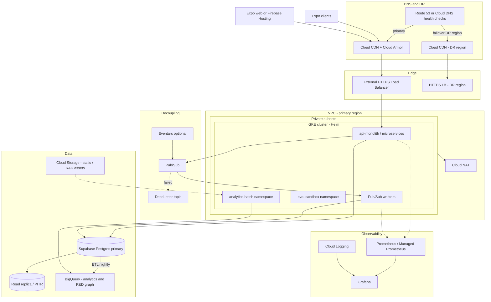
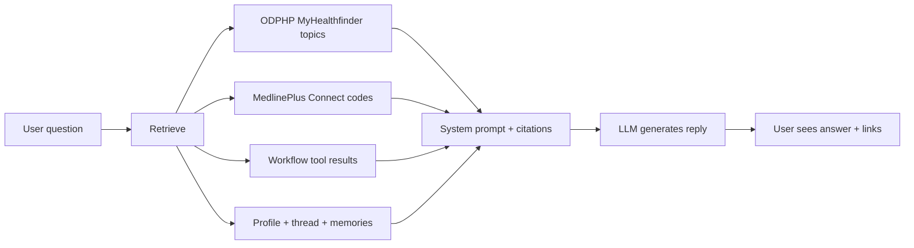
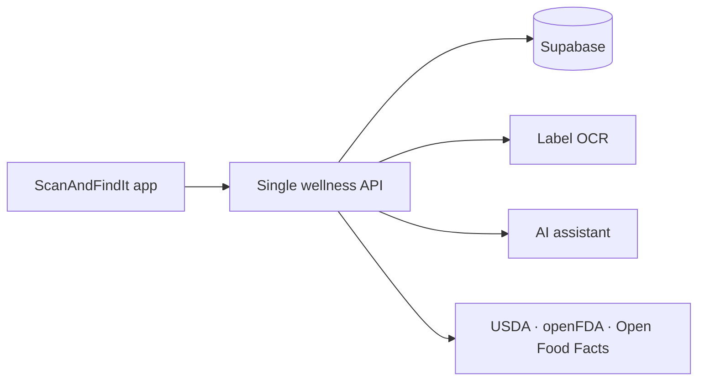
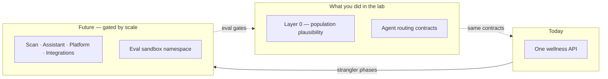

# Appendix — Reference architecture & RAG

Optional reading after the main lab exercises. Diagrams describe **where the product is headed** (Phase 2–3 on a hyperscaler), not what you run in Replit today. Deep-dive diagrams and platform tables live in [docs/architecture-reference.md](./docs/architecture-reference.md).

**Today (MVP):** Expo clients → Node API on managed PaaS (e.g. Heroku) → Supabase → OpenAI + Google Vision.  
**Future:** Same app logic on **GKE** (Google Cloud) or **EKS** (AWS), with async workers, CDN/WAF, analytics warehouse, and **eval automation** in CI + cluster sandbox.

**Hands-on — Trust the Gate (Part 3):** [README Part 3](./README.md#part-3--trust-the-gate-optional) — free kind + Terraform eval Job; no cloud account.

Pick **one** cloud for production — mixing GCP and AWS control planes adds operational cost.

---

## A. Future target — Google Cloud (GKE)

**Principle:** evolve incrementally. Near-term wins stay on managed PaaS before migrating the API to Kubernetes + Helm.

### A.1 Target diagram (Phase 2–3)

### A.2 Phased rollout (GCP)

| Phase | Focus | Path |
|-------|-------|------|
| **0 (now)** | Heroku API, Netlify web, Supabase | No change required to ship |
| **1** | DR docs, PITR, structured logs, SLO dashboards | Log drain → Cloud Logging |
| **2** | Decouple heavy work | Pub/Sub → GKE workers |
| **3** | API portability | GKE monolith Helm chart behind HTTPS LB + Ingress |
| **4** | Edge hardening | Cloud CDN + Cloud Armor |
| **5** | Multi-region DR | Second GCP region GKE + DNS failover |
| **R&D** | Property graph analytics | GKE + GCS + BigQuery |

---

## B. Future target — AWS (EKS)

Same phased goals as §A using AWS-native edge, networking, and observability. Helm charts and container images are **portable** between GKE and EKS; Ingress, IAM, and managed service bindings change.

| Phase | Focus | Path |
|-------|-------|------|
| **0 (now)** | Heroku API, Netlify web, Supabase | No change required to ship |
| **1** | DR docs, PITR, structured logs | CloudWatch Logs |
| **2** | Decouple heavy work | EventBridge / SNS → SQS → EKS workers |
| **3** | API portability | EKS behind ALB + AWS Load Balancer Controller |
| **4** | Edge hardening | CloudFront + AWS WAF |
| **5** | Multi-region DR | Second AWS region EKS + Route 53 failover |
| **R&D** | Analytics property graph | EKS + S3 + Athena/Glue |

> Full AWS target diagram (CloudFront, ALB, EKS, SQS, Athena): [architecture-reference §1](./docs/architecture-reference.md#1-aws-target--eks-phase-23).

---

## C. GCP (GKE) vs AWS (EKS) — for this product

Helm charts, Supabase, OpenAI, agent workflow, and eval gates are **portable** either way.

| | **GCP / GKE** | **AWS / EKS** |
|---|---------------|---------------|
| **Edge** | Cloud CDN + Cloud Armor | CloudFront + AWS WAF |
| **Async work** | Pub/Sub + dead-letter topics | EventBridge → SQS + DLQ |
| **Analytics warehouse** | **BigQuery** (documented R&D path) | **Athena + Glue** (or Redshift) |
| **Object storage** | GCS | S3 |
| **Vision / OCR today** | **Google Vision** shipped | Rekognition + Textract — deliberate migration |
| **Web static** | Firebase Hosting or GCS + CDN | S3 + CloudFront |

**Stays the same on either path:** Supabase OLTP + Auth, JWT client contract, agent eval suites, wellness API on Postgres.

**Practical takeaway:** Choose **GCP** for the documented BigQuery R&D path and lower Vision friction. Choose **AWS** if edge/IAM/data-lake skills are already there — budget engineering to migrate Vision or run it cross-cloud.

### C.1 Service mapping

| Concern | Google Cloud | AWS |
|---------|--------------|-----|
| Kubernetes | GKE | EKS |
| Ingress / LB | GCE Ingress / Gateway API | ALB + LB Controller |
| CDN + WAF | Cloud CDN + Cloud Armor | CloudFront + AWS WAF |
| Pod IAM | Workload Identity | IRSA |
| Scheduled jobs | Cloud Scheduler | EventBridge Scheduler |
| DNS + failover | Cloud DNS | Route 53 |

### C.2 Vision and analytics FAQ

**AWS Rekognition / Textract instead of Google Vision?** Yes, in principle — a **product migration**, not a config change. Requires a new adapter, re-tuning category inference, and re-running scan contract and safety evals.

| Pattern | When |
|---------|------|
| Keep Google Vision on AWS | Fastest path to EKS; accept cross-cloud API calls |
| Migrate to Rekognition + Textract | Long-term AWS consolidation |
| Stay on GCP + Vision | Lowest friction for current scan code |

**Why BigQuery?** Analytics warehouse, not the app database. **Athena + Glue on S3** is the intentional AWS mirror.

---

## D. In-app AI assistant (context for RAG)

Chat, voice, and in-thread images share one **server-side agent workflow** and up to **three skills per turn**. The client only executes `action` payloads (navigation, scan targets).

| Layer | Role |
|-------|------|
| **Safety** | Blocks jailbreaks and unsafe images before the LLM runs |
| **Understand** | Parses intent, locale, multimodal context |
| **Skills** | Injects up to 3 skill bodies (disclaimers, routing priority) |
| **Tools** | Nutrition lookup, SDOH, Healthy Map, internet search, scans, etc. |
| **Respond** | LLM reply + patient-education citations |

> Full production workflow diagram (Expo client → SSE chat → Supabase threads → OpenAI): [architecture-reference §2](./docs/architecture-reference.md#2-production-ai-assistant-workflow). README Part 2 covers the lab-level view.

---

## E. Retrieval & citations (RAG) — how data reaches the model

The assistant uses **retrieval-augmented generation** — replies are grounded on **fetched data injected into the prompt**, not on the model's memory alone. This is **not** a private document vector database in production today.

| Retrieval source | What it pulls | When |
|------------------|---------------|------|
| **ODPHP MyHealthfinder** | Public health-topic summaries (live API) | General wellness questions |
| **MedlinePlus Connect** | Patient education by ICD-10 or NDC/name | Health questions; after in-thread drug scans |
| **Workflow tools** | Internet search, scan results, SDOH, maps | Agent EXECUTE phase |
| **Profile + thread** | Goals, locale, conversation history | Every turn |
| **Long-term memories** | Stored user notes/preferences | **Keyword overlap** scoring today (not embeddings) |

Citations are merged, de-duplicated, and shown in the UI. Production evals check that replies align with retrieved sources and do not invent facts.

### E.1 Possible improvements (roadmap)

| Gap today | Improvement |
|-----------|-------------|
| Skill selection is keyword/trigger-based | Semantic / embedding retrieval for skills and memories |
| Memories use lexical overlap | Vector search (e.g. pgvector) |
| ODPHP/Medline are live API lookups | Semantic cache of frequent education queries |
| No unified retrieval index | Hybrid search over skills, citations, events |

---

## F. Eval sandbox on Kubernetes

The **eval-sandbox** namespace runs automated agent and population checks in CI — warm pools for regression, **not** user traffic. Same eval ideas you practiced in this lab scale to hundreds of cases before deploy in a full product stack.

Part 3 runs this pattern locally with kind + Terraform. See [README Part 3](./README.md#part-3--trust-the-gate-optional).

---

## G. CI automation — GitHub Actions (and Terraform)

### G.1 This lab repo

| Workflow | Trigger | What runs |
|----------|---------|-----------|
| `.github/workflows/evals.yml` | Push / PR to `main` | `npm run population-eval` + `npm run agent-eval` |

Same commands you run in Replit — no API keys.

### G.2 Production backend (conceptual — not in this repo)

| Workflow | Role |
|----------|------|
| Math / population evals | Nutrition cohort + persona checks on goal-calculator changes |
| Agent evals | 166+ routing and response-quality cases |
| Nightly agent evals | Full suites; optional **semantic judge** |
| Live staging evals | Weekly real API + OpenAI — catches drift mocks miss |
| Production / release readiness | Full test + eval gate before deploy |

### G.3 Terraform — Infrastructure as Code (future)

**Today:** API on Heroku, web on Netlify, Supabase SaaS — **no cloud Terraform in this lab**. For **Trust the Gate** (local Terraform + kind, $0), see [README Part 3](./README.md#part-3--trust-the-gate-optional).

**Phase 2–3 (planned):** [Terraform](https://developer.hashicorp.com/terraform/docs) provisions VPC, GKE/EKS, IAM, Pub/Sub (or SQS), CDN/WAF, observability. **Helm** deploys app workloads; **GitHub Actions** runs build → eval → `terraform plan` → (approved) `apply`.

| Concept | What it means |
|---------|--------------------------------|
| **Infrastructure as Code** | Infra in files, reviewed in PRs |
| **Declarative config** | Describe *desired state*; Terraform reconciles |
| **Plan vs apply** | `plan` = dry-run diff; `apply` = execute after review |
| **State** | Tracks what Terraform created (remote backend in GCS/S3 — **not** in git) |
| **Idempotency** | Re-run `apply` safely — no change → “0 to add, 0 to change, 0 to destroy” |

| Layer | Owns | Tool |
|-------|------|------|
| **Platform** | Clusters, networking, IAM, event bus, edge, observability | Terraform |
| **Workloads** | API, workers, eval-sandbox pods | Helm |
| **Pipeline** | Build → test → eval → plan/apply → deploy | GitHub Actions |

**Honest status:** Terraform is **planned**, not shipped. Eval gates stay in GitHub Actions — Terraform changes *where* workloads run, not *what* we verify.

---

## H. Managed services — today vs future

### H.1 MVP today

| Service | Role |
|---------|------|
| **Heroku** | Node API |
| **Netlify** | Expo web static |
| **Supabase** | Postgres, Auth, RLS |
| **OpenAI** | Assistant **generator** + optional **evaluator** judge |
| **Google Vision** | Scan labels, OCR, safe-search |
| **GitHub Actions** | CI evals |

### H.2 Future platform options

| Option | When it fits |
|--------|----------------|
| **Stay on PaaS longer** | Small team — add logging, backups, async queues first |
| **GKE + BigQuery** | Documented path; keep Google Vision; analytics R&D |
| **EKS + Athena/Glue** | Team already on AWS; budget Vision migration or cross-cloud calls |

### H.3 Future evals roadmap

| Direction | Notes |
|-----------|-------|
| **267-case offline gate** | Shipped in example production stack |
| **Live staging chat evals** | Weekly; real SSE/auth/threads |
| **Semantic judge** | Opt-in — not default PR CI |
| **Eval sandbox on GKE/EKS** | Planned — warm pool namespace |
| **Semantic retrieval eval layer** | Roadmap — paraphrase recall across locales |

**Principle:** Managed services reduce ops toil; **eval contracts stay version-controlled**.

---

## I. Algorithmic bias — mitigation & lab connection

Optional depth after [Integrity & wellness boundaries](./README.md#integrity--wellness-boundaries).

**One-line framing:** Bias mitigation here is **transparent rules + representative testing + integrity guardrails**, not “we trained on diverse data so the model is fair.” Synthetic cohort data is a **test harness**, not training data that debiases an ML model.

### I.1 Two surfaces where bias can appear

| Surface | Mechanism | Primary bias risk |
|---------|-----------|-------------------|
| **Nutrition goal math** | Deterministic formulas (BMI → BMR → activity → DGA bands) | Systematic over/under-estimation for body types, life stages, or activity levels |
| **In-app AI assistant** | LLM replies + routing/tools/skills across 6 locales | Wrong tool for a locale or phrasing; clinical overreach; training-data skew |

### I.2 Where bias can enter

| Source | Example |
|--------|---------|
| **Formula defaults** | Default activity = sedentary when unknown |
| **Sex/gender buckets in BMR** | Male/female/other floors and offsets |
| **High BMI handling** | Adjusted weight for BMR only — easy to mis-explain |
| **English-first routing patterns** | Typo or dialect not in regex |
| **LLM training data** | Tone, cultural food norms, gendered health advice |
| **Device & literacy barriers** | Vision scan fails; voice not available |
| **Research narrative** | Cohort simulation cited as “impact” |

### I.3 Mitigations in place today

**Nutrition math**

| Mitigation | What it does |
|------------|--------------|
| **Published standards** | [DGA 2020–2025](https://www.dietaryguidelines.gov/) bands, Mifflin–St Jeor BMR |
| **Special populations** | Pregnancy/lactation add-ons, BMI ≥ 30 adjusted weight, sex-specific floors |
| **Hand-curated personas** | Edge cases in population eval — `population-eval/synthetic-personas.json` |
| **Population eval** | NHANES-*like* synthetic adults; **≥ 85%** within DGA band |
| **No race-based targeting** | Product logic does not segment by race/ethnicity |

**AI assistant & product integrity**

| Mitigation | What it does |
|------------|--------------|
| **Offline routing evals** | Hundreds of cases in production; this lab teaches the **contract** idea |
| **Locale coverage** | Routing regression and disclaimer keys for **EN, ES, AR, ZH, HI, SW** |
| **Negative guards** | Food-safety questions stay in chat — do not open scanner |
| **Hallucination / grounding cases** | No diagnosis, no FDA approval claims, no invented profile data |
| **Mandatory citations** | ODPHP / MedlinePlus for educational replies |
| **Live + semantic judge (opt-in)** | Second model scores high-risk **wording** |

### I.4 Role of data — test harness, not debiasing training

| Use of data | Role | In this lab? |
|-------------|------|--------------|
| **NHANES-like synthetic cohort** | Sample demographics from published CDC summary statistics | **Yes** — `population-eval/` |
| **Fixed random seed** | Reproducible cohort between runs | **Yes** — change `SEED` in Part 1 |
| **Hand-curated personas** | Named edge cases the sampler might under-represent | **Yes** — `short_heavy_female_moderate` task |
| **User production data for ML training** | **Not used** for routing or calorie formulas | **No** |

### I.5 Eval & guardrail map

| Bias-adjacent failure | Eval / guardrail |
|-----------------------|------------------|
| Calorie targets drift low/high for many profiles | Population eval ≥ 85% in band; persona JSON |
| Wrong scanner by locale or typo | Routing cases per locale; typo cases |
| Assistant implies diagnosis or FDA approval | Hallucination guards; disclaimers |
| Invented user data | Factual-grounding cases |
| Harmful safety wording | Safety + response-quality cases |
| Non-English disclaimer gaps | Locale compliance tests |
| SDOH routed to wrong tool | SDOH routing cases + benefits-program guards |

### I.6 What passing does **not** prove

| Claim | Verdict |
|-------|---------|
| “Fair outcomes for all demographic groups” | **Not proven** by Layer 0 alone |
| “Clinically correct for any individual” | **Not proven** — plausibility only |
| “LLM replies are unbiased in tone and culture” | **Not fully proven** — offline contracts + optional judge reduce risk |
| “Synthetic cohort predicts real-world NHANES” | **Not claimed** |
| “No digital divide” | **Not measured** in lab |

### I.7 Lab exercises that touch bias

| Lab moment | Bias lesson |
|------------|-------------|
| [Part 1 — population eval](./README.md#part-1--trust-the-math) | Representative **testing** catches systematic math drift |
| [Part 2 — agent eval](./README.md#part-2--trust-the-agent) | “Helpful” wrong action is an integrity/bias failure |
| [Top 10 impact table](./README.md#part-2--trust-the-agent) | Each row locks a failure mode that breaks trust |
| [Self-debrief #3](./README.md#self-debrief) | One persona vs hundreds of synthetic profiles |

---

## J. Platform evolution & microservices

**Honest status:** **Kubernetes and microservices are not in production today.** This section describes a **future target** when scale metrics justify phased change.

**Related sections:** [§A–C](./APPENDIX.md#a-future-target--google-cloud-gke) (architecture) · [§G.3](./APPENDIX.md#g3-terraform--infrastructure-as-code-future) (Terraform) · [§I.6](./APPENDIX.md#i6-what-passing-does-not-prove) (what evals do not prove)

### J.1 Why this matters after the lab

At **large scale**, architecture choices affect whether eval contracts stay trustworthy:

- A vision spike on the food scanner should not slow down chat or goal math.
- A bad assistant deploy should not take down barcode lookup.
- Production **267 offline agent cases** and the **Layer 0 population gate** must still pass after every infrastructure change.

### J.2 Today — one API, many features

Mobile and web talk to **one Node API** on managed hosting (Heroku). User data lives in **Supabase**. Scan labels use **Google Vision**; the assistant uses **OpenAI**.

This is the **right shape for MVP** — one deployable API, strong module structure inside, eval gates in CI.

### J.3 The plan — evolve in slices (strangler fig)

New pieces grow around the old system; traffic moves **slice by slice**; obsolete parts are removed only when the replacement is proven.

| Step | Meaning | Example |
| ---- | ------- | ------- |
| **1. Understand today** | Map what exists | One API, many internal modules |
| **2. Tighten modules** | Clear boundaries before splitting | Contracts between scanning, goals, assistant |
| **3. Separate database areas** | Logical ownership before physical split | Postgres *schemas* per domain |
| **4. Define standalone services** | Container + deploy unit per slice | Scan, assistant, platform, integrations |
| **5. Deploy and validate (no user traffic)** | Shadow and eval traffic only | [FTGO Step 3](https://microservices.io/refactoring/example-of-extracting-a-service.html) |
| **6. Route traffic gradually** | Canary paths to new service | Users keep **the same app URL** |
| **7. Remove old code** | Delete extracted routes from monolith | Smaller core until fully modernized |

### J.4 Future shape — four core services (+ workers)

The **same app** will still call **one public API address**. Behind the load balancer, work splits by **cost and risk profile**:

| Future service | What it owns | Why split it |
| -------------- | ------------ | ------------ |
| **Scan** | Food/plastic/drug/pet scans, nutrition lookup | Vision cost and burst traffic |
| **Assistant** | Chat, voice, tool routing, thread history | LLM cost, long-lived connections, safety pipeline |
| **Platform** | Profile, health timeline, goals, check-ins | Steady CRUD; single writer for timeline events |
| **Integrations** | Wearables, weather, health news, maps | OAuth tokens, scheduled sync jobs |
| **Social** (optional, later) | Teams, feed, wellness studio posts | Defer until v3 scale needs it |

**Workers** handle timeline rollups, recall alerts, and wearable sync — so heavy jobs do not block scan or chat.

> Full microservices architecture diagram (CDN, API Gateway, Pub/Sub, Redis, GCS): [architecture-reference §3–4](./docs/architecture-reference.md#3-future-service-topology-simplified).

### J.5 Phased timeline — when, not if-by-date

Migration is **gated by metrics**, not a calendar mandate.

| Phase | What changes | User-visible impact |
| ----- | ------------ | ------------------- |
| **0 — Foundation** | Stronger module contracts; timeline events | **None** |
| **1 — Container lift** | Same code on Kubernetes with Helm | **None** — DNS/ops only |
| **2 — Async workers** | Event bus (Pub/Sub) + background jobs | **None** — faster dashboards over time |
| **3 — First splits** | Scan + assistant; **shadow/canary** before full routing | **None** — same API URL |
| **4 — Platform + integrations** | Remaining domains extracted | **None** |
| **5 — Edge + optional social** | CDN/WAF hardening; social split if needed | **None** |

First service extractions are **earliest ~12–18 months** after foundation gates pass — subject to measurable scale triggers.

### J.6 Shadow, canary, and rollback criteria

Each phase follows [FTGO Step 3](https://microservices.io/refactoring/example-of-extracting-a-service.html): **deploy first, route user traffic only after validation**.

| Phase | Rollback trigger | Rollback action |
| ----- | ---------------- | --------------- |
| **0 — Foundation** | Layer 0 or agent eval failure | Block merge / deploy |
| **1 — Container lift** | p99 latency > baseline +20%; error rate > 0.5% | DNS back to Heroku |
| **2 — Async workers** | Duplicate rollups; consumer lag > SLO; DLQ spike | Disable consumers; monolith fallback |
| **3 — First splits** | Agent eval failure; shadow diff on golden scans | Ingress **100% to monolith** |
| **4 — Platform + integrations** | DSAR or sync failures | Route paths back to core-api |
| **5 — Edge + optional social** | Moderation SLA breach; WAF false positives | Revert rules |

**Every phase gate (before increasing traffic):**

1. Offline agent eval suite passes (production: **267 cases**; lab teaches a subset)
2. **Layer 0 population eval** passes (≥ 85% DGA band)
3. Shadow/canary metrics within SLO (error rate, latency, cost)
4. Rollback runbook tested in staging

### J.7 What never changes

| Commitment | Why it matters to the lab |
| ---------- | ------------------------- |
| **Same app API URL** | Client and eval configs stay stable |
| **Agent routing eval gate, zero allowed failures** (production) | Routing and safety locks survive infra moves |
| **Layer 0 population eval (≥ 85% DGA band)** | Goal math pipeline unchanged in meaning |
| **General wellness framing; no FDA approval claims** | Disclaimers enforced in evals and copy |
| **Six locales** (EN, ES, AR, ZH, HI, SW) | Locale compliance tests still apply |
| **Supabase as primary user database** | No “migrate all user data day one” surprise |

### J.8 What offline evals prove — and what they do **not**

| Eval layer | What passing **proves** | What passing does **not** prove |
| ---------- | ----------------------- | -------------------------------- |
| **Layer 0 — population** | DGA-band plausibility for the formula pipeline | Clinical correctness for any individual |
| **Offline agent cases** | Tool routing, safety blocks, forbidden-claim **wording contracts** | Live OpenAI **wording drift**; end-to-end auth or network wiring |
| **Forbidden-claim / locale tests** | No FDA-approval claims in tested strings; six-locale disclaimer patterns | Legal sign-off; WCAG audit; tone/cultural bias in LLM replies |
| **Live staging evals** *(weekly — not deploy gate)* | End-to-end action, streaming, safety over the wire | Not on every PR — drift can appear between runs |

- Evals verify **alignment in code** — they are **not legal proof** of FDA, ADA, or privacy compliance.
- Offline mocks **cannot** catch model drift, cross-service wiring bugs, or production IAM/network misconfiguration.

See [Live evals — beyond the offline gate](./README.md#live-evals--beyond-the-offline-gate).

### J.9 Drift detection

**Drift** is overloaded. ScanAndFindIt treats two kinds separately:

| Concept | What drifts | Primary risk |
| ------- | ----------- | ------------ |
| **Machine learning drift** | Data distributions, model outputs, algorithm behavior | Wrong calories, unsafe assistant wording |
| **Infrastructure drift** | Deployed runtime vs version-controlled intent | Auth misconfig, eval gates bypassed, wiring bugs |

Neither replaces the other. Offline agent evals can pass while hosting config drifts. A green deploy can still ship into an OpenAI model that rephrases safety disclaimers.

#### ML drift — detection today

Most “ML drift” here is **contract and plausibility drift** — not retraining pipelines. Models are **managed APIs** (OpenAI, Google Vision).

| Signal | How detected | Response |
| ------ | ------------ | -------- |
| Goal-calorie pipeline | Population eval — **≥ 85%** within DGA band | Block merge/deploy |
| Formula edge cases | 15 hand-curated personas | Same gate |
| Tool routing, safety, grounding | **267 offline cases** — mocked LLM/tools | **Deploy gate** — zero failures |
| High-risk reply wording | Optional semantic judge; live response evals | Prompt/safety patch — **not** auto-retrain |
| End-to-end assistant behavior | **12 live chat cases** — weekly staging | Artifact review — **not** deploy blocker |

**Limitations:**

- Offline mocks **cannot** see live OpenAI **wording drift**
- Live evals run **weekly**, not on every PR
- No production **data-distribution** monitors
- **No retraining workflow** — mitigation is prompt/safety/routing code changes plus eval expansion

#### Infrastructure drift — detection today

**Today:** Heroku, Netlify, Supabase — **no Terraform or GitOps in the public lab repo** (planned Phase 1+).

| Layer | How detected | Response |
| ----- | ------------ | -------- |
| **Pre-deploy integrity** | Math evals + 267 agent cases + AI safety tests | Block publish |
| **Release structure** | Required surfaces, locale tests, compliance files | Block merge |
| **CI hygiene** | Unit tests, schema checks, security scans | Block merge |
| **Deploy config presence** | Required hosting secrets and smoke URLs | Block deploy |
| **Post-deploy smoke** | API health after push | Fail deploy job |
| **Database schema** | Versioned SQL migrations in source control | Manual/CI apply — **no** automated drift scan vs live DB |
| **Runtime errors** | Sentry (API + mobile) | Ad hoc investigation |

**Gaps (Phase 1+ targets):** IaC reconciliation (Terraform `plan` in CI), GitOps (Helm + Argo CD / Flux), continuous config audit, infra shadow/canary before K8s cutover.

**Summary:** Pipeline and schema **version control** prevent *shipping* known-bad code; they do **not** continuously prove production PaaS settings match the repo. That gap closes with Terraform plan/apply and GitOps reconciliation.

#### Drift comparison

| Drift type | How detected | Mitigation |
| ---------- | ------------ | ---------- |
| **Algorithm / population** | Math eval gate in CI | Fix goal code; block deploy |
| **Agent routing & safety** | 267 offline cases | Block deploy; expand eval cases |
| **Live LLM wording & E2E** | Weekly live staging; opt-in semantic suites | Prompt/safety fixes — not deploy gate |
| **Production data / concept drift** | **Not implemented** | Planned observability backlog |
| **Deploy / config integrity** | Pre-deploy verification + CI checks | Block deploy |
| **Cloud infra vs IaC** | **Not implemented** — no Terraform in repo today | Planned: Terraform plan on PR |

**Key point:** **Scale the gates, not away from them.** Shadow traffic and Terraform plan diffs **expand** drift detection after infra phases — they don't replace Layer 0 or agent locks.

### J.10 One-page summary

| | Today | Future (when justified) |
|---|-------|-------------------------|
| **Deploy units** | 1 API | 4 core APIs + workers (+ optional social) |
| **Hosting** | Heroku + Supabase | GKE or EKS + Supabase |
| **User URL** | One API base | **Same** |
| **Eval gates** | Layer 0 + agent routing | **Same** + re-run after moves |
| **Wellness posture** | Disclaimers, no FDA claims | **Unchanged** |

### J.11 AI workloads on Kubernetes *(optional — architects)*

Modern platforms run **microservices and AI on the same operational plane**. Treat AI as **another workload class** — different scheduling, cost, and security — not a separate island.

| Choice | When |
| ------ | ---- |
| **Managed APIs** (OpenAI, Vertex AI) | MVP, spiky traffic — **ScanAndFindIt today** |
| **Self-hosted on K8s** | Steady high QPS, strict data residency, token economics favor owned GPU |
| **Hybrid** | Microservices on GKE/EKS; primary LLM via managed API; small GPU pool for batch evals in eval-sandbox |

ScanAndFindIt today uses managed OpenAI + Google Vision — appropriate for eval-gated assistant contracts.

> Production foundations (shared responsibility, IAM/secrets, networking/DR/observability) and integrity-at-scale matrix: [architecture-reference §7–8](./docs/architecture-reference.md#7-integrity--compliance-at-scale). Not required to complete the lab.

---

*This appendix uses only public architecture concepts and educational stubs. It does not grant production access, cloud accounts, or legal advice.*
