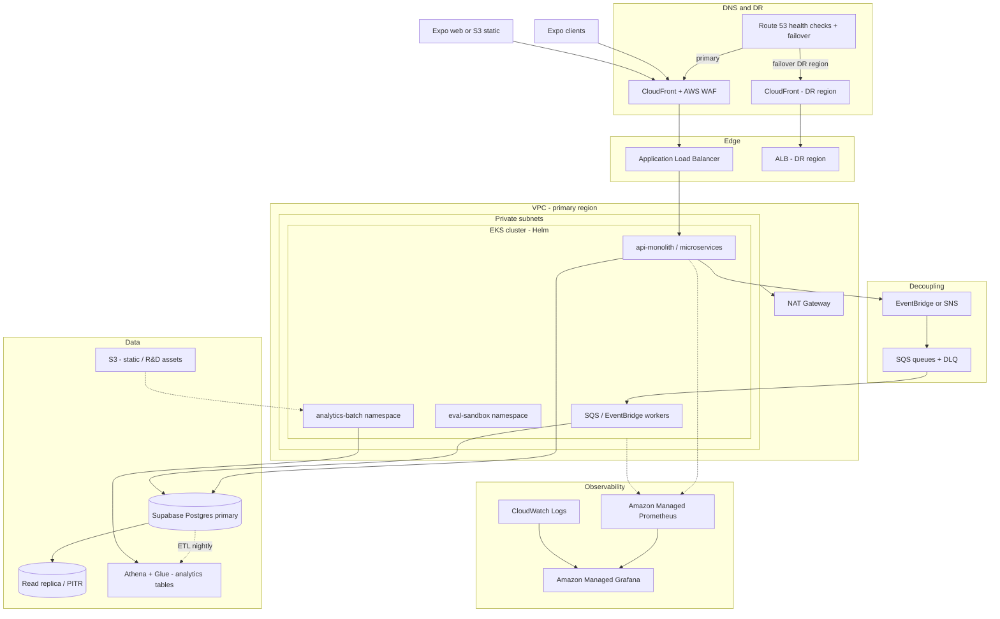
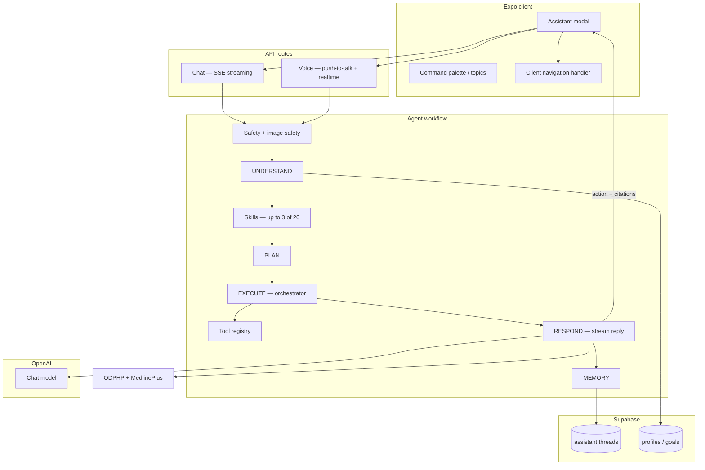
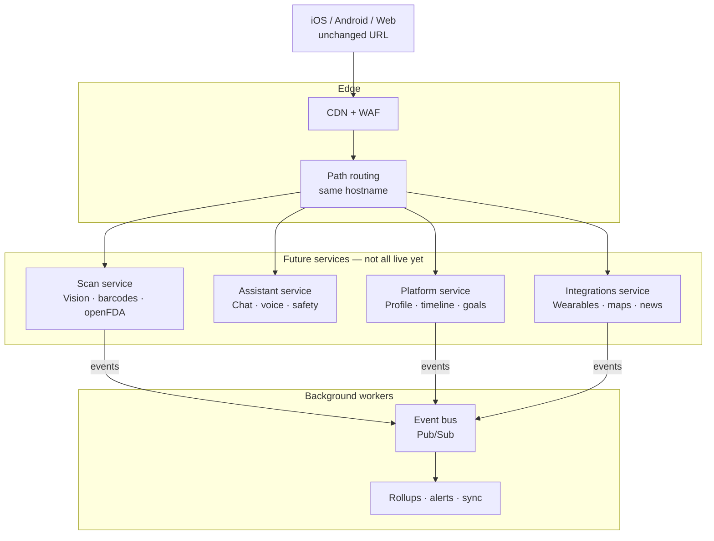
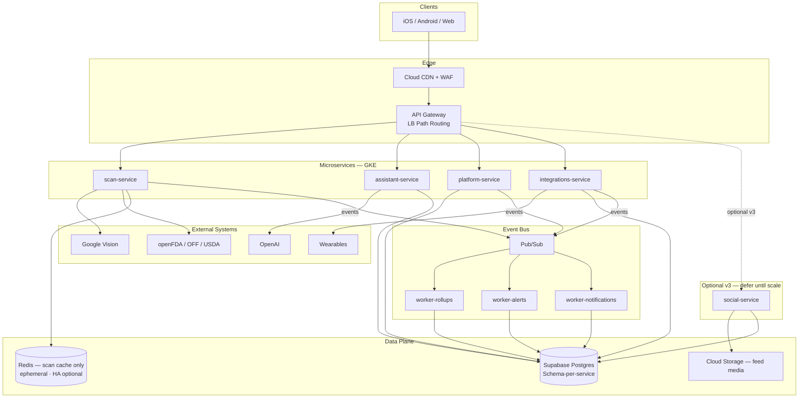
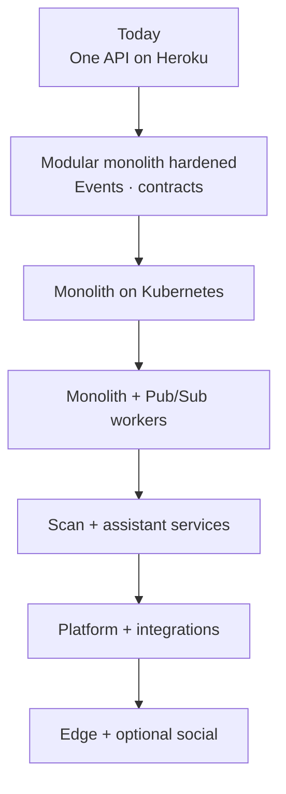

# Architecture reference

Optional deep-dive diagrams and platform tables moved out of [APPENDIX.md](../APPENDIX.md) to keep the main appendix lean. **Not required to complete the lab.**

**Related:** [APPENDIX §A](../APPENDIX.md#a-future-target--google-cloud-gke) (GKE cluster view) · [APPENDIX §J](../APPENDIX.md#j-platform-evolution--microservices) (platform evolution summary) · [README Part 2](../README.md#part-2--trust-the-agent) (lab-level agent diagram)

---

## 1. AWS target — EKS (Phase 2–3)

Mirrors [APPENDIX §A.1](../APPENDIX.md#a1-target-diagram-phase-23) structurally, using AWS-native edge, networking, and observability.

Phased rollout table: [APPENDIX §B](../APPENDIX.md#b-future-target--aws-eks).

---

## 2. Production AI assistant workflow

Full server-side workflow (chat, voice, in-thread images). The [README Part 2](../README.md#part-2--trust-the-agent) diagram is the lab-level view.

| Layer | Role |
|-------|------|
| **Safety** | Blocks jailbreaks and unsafe images before the LLM runs |
| **Understand** | Parses intent, locale, multimodal context |
| **Skills** | Injects up to 3 skill bodies (disclaimers, routing priority) |
| **Tools** | Nutrition lookup, SDOH, Healthy Map, internet search, scans, etc. |
| **Respond** | LLM reply + patient-education citations |

RAG retrieval flow: [APPENDIX §E](../APPENDIX.md#e-retrieval--citations-rag--how-data-reaches-the-model).

---

## 3. Future service topology (simplified)

High-level split by cost and risk. **Not live today.**

| Future service | What it owns | Why split it |
| -------------- | ------------ | ------------ |
| **Scan** | Food/plastic/drug/pet scans, nutrition lookup | Vision cost and burst traffic |
| **Assistant** | Chat, voice, tool routing, thread history | LLM cost, long-lived connections, safety pipeline |
| **Platform** | Profile, health timeline, goals, check-ins | Steady CRUD; single writer for timeline events |
| **Integrations** | Wearables, weather, health news, maps | OAuth tokens, scheduled sync jobs |
| **Social** (optional, later) | Teams, feed, wellness studio posts | Defer until v3 scale needs it |

---

## 4. Target microservices architecture (full diagram)

**Future steady state** — pairs with [§A.1](../APPENDIX.md#a1-target-diagram-phase-23) (cluster-level view) and §3 above (simplified topology).

| Layer | What it is | You care because… |
| ----- | ---------- | ----------------- |
| **Clients** | Same app on iOS, Android, web | No new URL |
| **Edge (CDN + WAF)** | Global cache + web application firewall | Protects assistant routes from abuse at scale |
| **API Gateway** | One hostname; routes like `/api/food/*` → scan, `/api/chat/*` → assistant | Invisible to users; one API base URL |
| **Microservices** | **Four core** deploy units (+ social optional v3) | Scan/assistant spikes don't take down goals or timeline |
| **Event bus (Pub/Sub)** | Durable pub/sub for domain events | Scan completes → timeline updates without blocking your request |
| **Workers** | Background jobs (rollups, alerts, notifications) | Dashboards stay fast |
| **Data plane** | Supabase (schema-per-service); **Redis for scan-result cache only**; GCS for optional social media | Logical ownership per domain — see §5 |
| **Eval sandbox namespace** | Separate K8s namespace for CI golden queries | Full production gate runs warm; never shares live user traffic — [APPENDIX §F](../APPENDIX.md#f-eval-sandbox-on-kubernetes) |

**One-line summary:** *One front door for the app; four core kitchens behind it — social is optional later; an event bus for side effects; same Supabase and same eval gates.*

---

## 5. Data architecture — interim vs target

Schema-per-service on **one Supabase Postgres** is an **interim** pattern, not the final autonomy target.

| Stage | Pattern | Consistency | When |
| ----- | ------- | ------------- | ---- |
| **Interim (Phase 0–2)** | Shared Postgres; logical schemas; monolith service role | Strong consistency inside the monolith | Now → first K8s lift + async workers |
| **Mid (Phase 3–4)** | Schema-scoped DB credentials; **single writer** for timeline events (platform-service) | **Eventual** consistency across services via Pub/Sub | After first service extractions |
| **Target (Phase 5+)** | Optional read replicas; BigQuery/Athena for analytics | OLTP stays Postgres; analytics decoupled | When scale and team justify it |

**Transactional boundaries (not one ACID transaction after split):**

| Flow | Pattern | Owner |
| ---- | ------- | ----- |
| Profile + onboarding | **Single transaction** | platform-service |
| Scan → timeline | **Eventual** via `scan.completed` → platform consumer | scan publishes; platform writes events |
| Goal recompute | **Eventual** via profile-updated event | platform-service |
| OAuth token refresh | **Integrations-service only** | No cross-service token reads |

**Distributed event patterns (required once async workers and splits are live):**

| Pattern | Purpose |
| ------- | ------- |
| **Transactional outbox** | DB write and event emit succeed or fail together |
| **Idempotency keys** | Prevent duplicate timeline rows on Pub/Sub retries |
| **Dead-letter topic (DLQ)** | Poison messages do not block the bus; replay after fix |
| **At-least-once delivery** | Consumers must be idempotent — assume duplicates |

> **Coupling risk:** Shared Supabase still shares connection limits and migration blast radius. Schema-per-service is **ownership enforcement**, not full isolation, until credentials and write paths are scoped per domain.

---

## 6. Phased migration timeline

Migration is **gated by metrics**, not a calendar mandate.

Phase tables and shadow/canary criteria: [APPENDIX §J.5–J.6](../APPENDIX.md#j5-phased-timeline--when-not-if-by-date).

---

## 7. Integrity & compliance at scale

| Concern | How the plan protects users |
| ------- | ---------------------------- |
| **FDA / wellness copy** | Forbidden-claim evals on every release; [Integrity section](../README.md#integrity--wellness-boundaries) |
| **Accessibility (ADA / WCAG)** | **Client UI** owns WCAG; API preserves response schemas and localized content |
| **Security** | Every service validates the same Supabase JWT; scoped database access per domain |
| **Privacy / DSAR** | Account deletion and export stay in platform service until redesigned |
| **AI safety** | Assistant service isolates moderation and tool allowlists; evals lock worst-case routing |

---

## 8. Production platform foundations

Applies **before** service splits are production-ready. Cluster diagrams: [APPENDIX §A](../APPENDIX.md#a-future-target--google-cloud-gke) · §1 above (AWS EKS).

### Shared responsibility

| Layer | **Cloud provider** owns | **Product team** owns |
| ----- | ------------------------- | --------------------- |
| Datacenter, managed K8s control plane | ✓ | |
| VPC, firewall, NAT, load balancers (configuration) | Partial | ✓ configure |
| Pod security — RBAC, network policy, secrets | | ✓ |
| Application code, eval gates, wellness copy, JWT validation | | ✓ |
| **Supabase** Postgres, Auth | Supabase ops | Schema, RLS, backup verification, DSAR |
| **OpenAI / Google Vision** | Vendor | Prompts, safety gates, DPAs, key rotation |

> **Today:** API on **Heroku PaaS** with env-var secrets — no self-managed VPC. Below describes the **target** after K8s lift (Phase 1+).

### IAM and secrets

| Concern | Today (MVP) | Target (GKE / EKS) |
| ------- | ----------- | ------------------- |
| **Cloud IAM** | PaaS config vars | Per-workload service accounts — **Workload Identity** (GKE) or **IRSA** (EKS) |
| **Secrets** | Heroku config | **Secret Manager** / **Secrets Manager** + External Secrets Operator |
| **App auth** | Supabase JWT | Same JWT on **every** service |
| **DB credentials** | Single service role | Schema-scoped credentials (Phase 3–4) |

### Networking, DR, and observability

| Area | Target pattern |
| ---- | -------------- |
| **Networking** | Private subnets for cluster nodes; CDN + WAF at edge; NAT for vendor API egress |
| **DR / backup** | Supabase PITR verified; Phase 5 multi-region cluster + DNS failover (RTO ~5–15 min target) |
| **Observability** | Centralized logs; Prometheus + Grafana; distributed tracing; SLO alerts |
| **Gap today** | Heroku logs + Sentry — no unified APM; Phase 1 milestone before K8s cutover |

Async **Pub/Sub** workers can catch up after an outage without blocking the synchronous API.

---

*Reference material only — not required for the lab. Does not grant production access, cloud accounts, or legal advice.*
