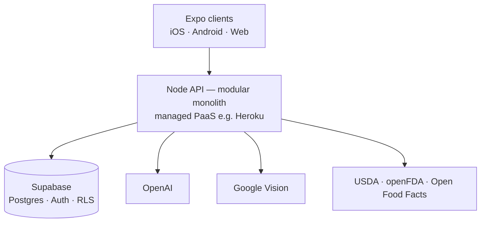
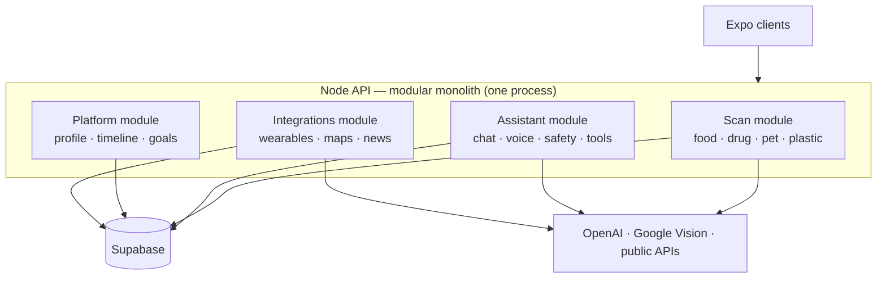
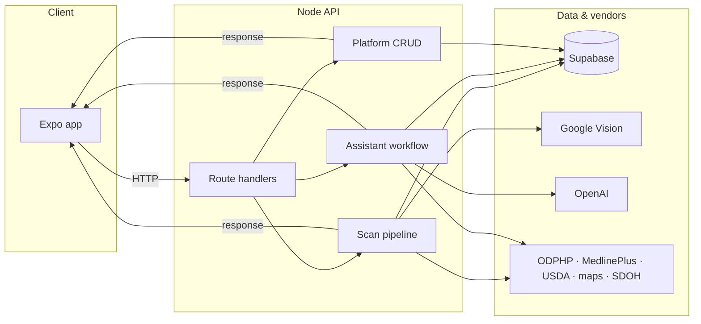
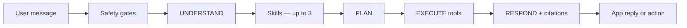
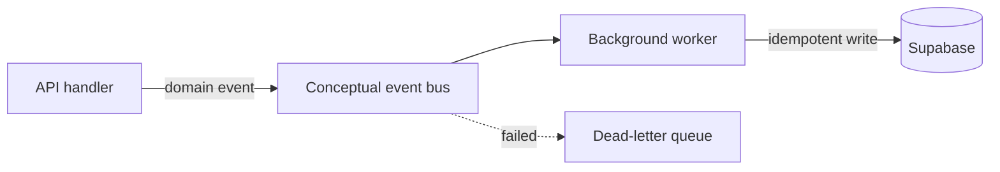
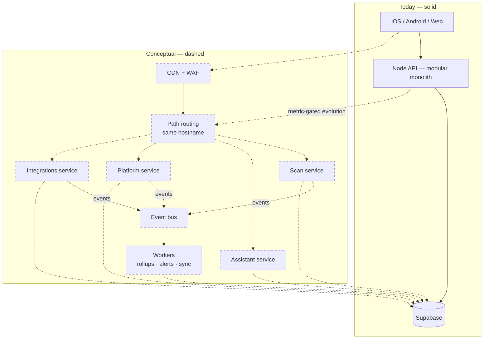

# Architecture diagrams

**Structural truth snapshots** — what exists and how it connects. For reasoning, tradeoffs, and scaling logic, see [APPENDIX.md](../APPENDIX.md).

**Legend:** Solid boxes and arrows = implemented today · Dashed = conceptual / future / conditional

**Order:** Current system → domain modules → data flow → event model → conceptual scaling (last)

---

## 1. Current system

**Anchor diagram** — the only “real system of record” view. One Node API on managed PaaS; Supabase and vendor APIs as external dependencies.

| Piece | Role |
|-------|------|
| **Expo client** | Scan UI, goals, timeline, assistant |
| **Node API** | Single deploy unit; internal module boundaries |
| **Supabase** | Primary user database and auth |
| **OpenAI** | Assistant generation |
| **Google Vision** | Label OCR and safe-search |
| **Public APIs** | Nutrition and recall lookups |

---

## 2. Domain module map

**Hero diagram for modular monolith** — four logical domains inside **one** API process. No network boundary between modules today.

| Module | Owns | Split trigger (future) |
|--------|------|------------------------|
| **Scan** | Scans, nutrition lookup, Vision | Burst traffic, Vision cost |
| **Assistant** | Chat, routing, threads, safety | LLM cost, long-lived connections |
| **Platform** | Profile, timeline, goals | Steady CRUD; timeline single-writer |
| **Integrations** | OAuth, wearables, maps | Scheduled sync, token isolation |

Domain reasoning: [APPENDIX §3](../APPENDIX.md#3-domain-model-logical-modules)

---

## 3. Data flow

Request paths reviewers understand fastest — synchronous flows today.

### Assistant turn (logical)

Chat, voice, and in-thread images share one server-side workflow. Dashed layers are conceptual orchestration inside the monolith — not separate deploy units.

| Layer | Status |
|-------|--------|
| **Safety, Respond, Supabase threads** | Implemented |
| **Understand, Skills, Plan, EXECUTE orchestration** | Logical model inside monolith |

RAG retrieval detail: [APPENDIX §3 — Retrieval](../APPENDIX.md#retrieval--citations-rag)

---

## 4. Event model

**Lightweight — not implemented today.** Introduced in Phase 2 (async workers) before any service split.

| Pattern | Purpose |
|---------|---------|
| **Transactional outbox** | DB write and event emit succeed or fail together |
| **Idempotency keys** | Prevent duplicate timeline rows on retries |
| **DLQ** | Poison messages do not block the bus |
| **At-least-once delivery** | Consumers must be idempotent |

Example: `scan.completed` → platform worker writes timeline event without blocking the scan response.

Scaling sequence: [APPENDIX §4](../APPENDIX.md#4-scaling-model)

---

## 5. Conceptual scaling model

> **Not implemented.** One future decomposition view — queue, workers, optional service splits. Same public API URL; users see no change.

| Stage | Deploy units | Hosting |
|-------|--------------|---------|
| **Today** | 1 API | Managed PaaS + Supabase |
| **Future (when justified)** | 4 core APIs + workers | GKE or EKS + Supabase |
| **Unchanged** | Same API URL, same eval gates, same wellness posture | — |

Phased timeline and rollback criteria: [APPENDIX §4](../APPENDIX.md#4-scaling-model) · [§7](../APPENDIX.md#7-future-architecture-compressed)

---

*Reference material only — not required for the lab. Does not grant production access, cloud accounts, or legal advice.*
